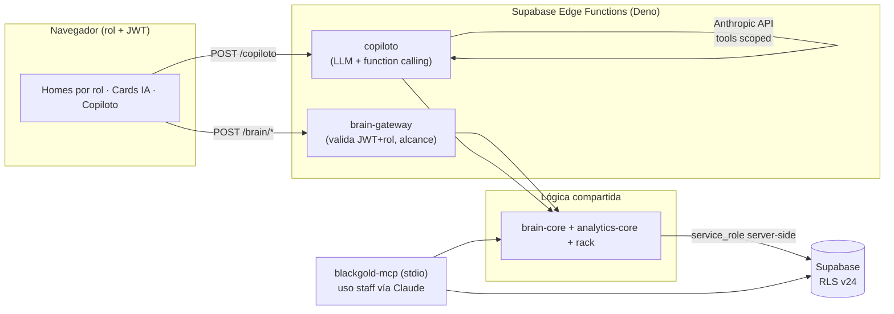
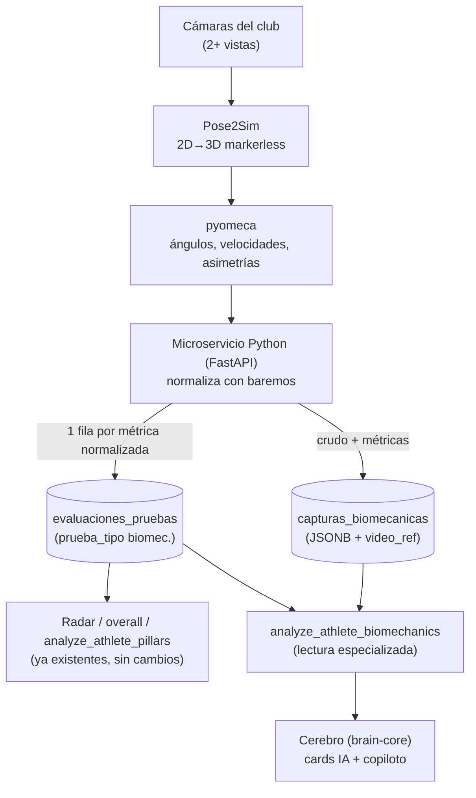
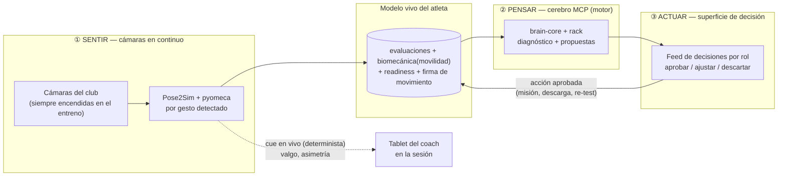

# Blueprint de rediseño frontend — experiencia por rol, cerebro MCP y ruta biomecánica

> Documento de diseño. Fecha: 2026-07-07. Estado: propuesta para arrancar el rediseño.
> Acompaña a `docs/design_system.md`, `docs/evaluacion_ingenieria_producto.md` y `docs/plan_remediacion_seguridad.md`.
>
> **Qué decide este documento:** cómo pasar de "un dashboard genérico + guards por rol" a **cinco experiencias nativas por rol**, cómo hacer que el mismo "cerebro" que hoy vive en `blackgold-mcp` alimente la interfaz de cada rol (por dos vías: **panel IA determinista vía Edge Function** + **copiloto conversacional embebido**), y cómo dejar el modelo de datos y la analítica **listos para la ruta biomecánica** (Pose2Sim → pyomeca → microservicio → Supabase → `analyze_athlete_biomechanics`) sin romper nada de lo actual.

---

## 0. TL;DR

1. **El gap está localizado.** `atleta` y `padre` ya tienen vistas propias (`AthleteLayout`, `PadreDashboard`). `superadmin`, `owner` y `coach` **comparten** el mismo `/dashboard` genérico (`App.jsx` = grid de atletas + filtros). Ahí está el 80% del margen de rediseño.
2. **El cerebro del MCP hoy no toca la app.** El frontend usa `analytics-core` + Supabase directo; las 18 tools del MCP (diagnóstico, misiones, readiness, rack documental) las usa el staff *por fuera*. El rediseño trae ese cerebro **dentro** de cada rol.
3. **La forma de traerlo es un "brain gateway" server-side.** Una capa HTTP (Edge Functions Supabase, Deno) que reusa `analytics-core` y el `rack` — el mismo código que ya consume el MCP — y respeta RLS/rol. Sobre ese gateway se montan las dos vías: *cards IA deterministas* (rápidas, sin LLM) y *copiloto conversacional* (LLM con function-calling sobre las tools).
4. **La biomecánica encaja como "una prueba más".** El microservicio Python normaliza sus métricas con los mismos baremos y escribe filas en `evaluaciones_pruebas`; los datos crudos (pose, video, cinemática) van a una tabla nueva `capturas_biomecanicas`. Así, `analyze_athlete_pillars` y el radar **se benefician automáticamente**, y `analyze_athlete_biomechanics` solo añade la lectura especializada (asimetría, valgo, calidad de aterrizaje).
5. **Orden sugerido:** Fase 0 brain gateway → Fase 1 homes nativos (coach + atleta primero) → Fase 2 cards IA → Fase 3 copiloto → Fase 4 biomecánica (puede arrancar en paralelo desde el modelo de datos) → Fase 5 OpenSim.

---

## 1. Diagnóstico del estado actual

### 1.1 Roles y routing hoy

Cinco roles: `superadmin`, `owner`, `coach`, `atleta`, `padre` (`RootRedirect` manda a `/padre` a los padres y a `/dashboard` al resto). Las rutas y sus guards (`PrivateRoute roles={[...]}` en `src/main.jsx`):

| Ruta | Roles permitidos | Vista |
|------|------------------|-------|
| `/dashboard` | superadmin, owner, coach, **atleta** | `App.jsx` (grid) — pero atleta cae aquí y `App` conmuta a `AthleteLayout` |
| `/padre` | padre | `PadreDashboard` |
| `/admin/atletas` | superadmin, owner, coach | CRUD atletas |
| `/admin/misiones` | superadmin, owner, coach | Catálogo/asignación de misiones |
| `/admin/pagos` | superadmin, owner, coach | Pagos |
| `/admin/comunicaciones` | superadmin, owner, coach | Comunicaciones segmentadas |
| `/admin/eventos` | superadmin, owner, coach | Eventos/convocatorias |
| `/admin/asistencia` | superadmin, owner, coach | Asistencia |
| `/admin/sesiones` | superadmin, owner, coach | Planificación de sesiones |
| `/admin/kpis` | superadmin, owner | `OwnerKPIsPage` |

**El problema central:** el "home" (`/dashboard`) es el mismo grid de atletas para superadmin, owner y coach. La navegación (Sidebar) esconde ítems por rol, pero la **página de entrada no está pensada para lo que cada rol viene a hacer**. Un coach entra a "gestionar su día" (sesión de hoy, quién viene, a quién evaluar); un owner entra a "leer el estado del club" (KPIs, retención, dinero); un superadmin entra a "que el sistema y el cerebro estén sanos". Hoy los tres ven lo mismo.

### 1.2 Lo que sí está bien y hay que preservar

- **Design system real y tokenizado** (`src/styles/tokens.css`, `src/lib/designTokens.js`): gold/black, rangos (Rookie→Leyenda Mamba), tiers de baremo (poor→excellent). Regla de gobernanza: no introducir hex nuevos, tokenizar primero. **El rediseño reusa este lenguaje visual íntegro**; cambia la *arquitectura de información* por rol, no la paleta.
- **PWA mobile-first** con safe-area, code-splitting por vista (lazy), Service Worker con auto-update. Cualquier home nuevo se suma como chunk lazy más.
- **Capa de servicios** `src/api/*Service.js` como única puerta a Supabase, con filtrado a nivel SQL (p.ej. coach ve solo su `categoria_feb`). El rediseño **no** habla con Supabase desde componentes; añade servicios/hooks.
- **`analytics-core` como fuente única** (taxonomía, baremos, radar, recomendaciones), ya consumida por web + MCP + Edge Functions. Es la palanca clave: es *portable* y *determinista*.
- **Modo Cancha** (`ModoCanchaModal`) — captura en campo, asistencia, evaluación por lotes, insignias. Es la joya del coach y el punto natural de anclaje de la captura biomecánica.

### 1.3 El cerebro que aún no entra a la app

`blackgold-mcp` expone **18 tools** (verificadas en `src/index.js`). Se agrupan así:

**Analíticas de atleta (el "diagnóstico 360°"):**
- `analyze_athlete_pillars` — resumen por sub-pilar (promedio 0-100 + tier) + notas subjetivas → prompt de diagnóstico.
- `analyze_athlete_readiness` — señales de disponibilidad con nombres propios: `deshidratado_extremo`, `hidratacion_baja`, `sueno_deficiente`, `fatiga_alta`, `sobreentrenamiento_activo`, `fatiga_silenciosa`, `rpe_extremo`.
- `generate_custom_mission` — sub-pilares `poor`/`below_avg` → contexto para misiones individualizadas.
- `suggest_next_test` — qué prueba tomar próximamente + justificación.

**Rack documental deportivo (el "conocimiento del club"):**
- `consultar_rack` — búsqueda BM25 léxica sobre el corpus (`knowledge/` + docs del repo).
- `listar_rack` — inventario/cobertura documental, detección de huecos.
- `mapa_conocimiento` — mapa de cobertura por área/sub-pilar.
- `consultar_metodologia_iniciacion` — metodología de iniciación (Vinueza).

**Curación de catálogos (trabajo de staff/superadmin):**
- `generar_catalogo_misiones`, `insertar_misiones_catalogo`, `insertar_misiones_recuperacion`, `auditar_misiones`, `actualizar_misiones`, `eliminar_misiones_basura`.
- `generar_catalogo_pruebas`, `insertar_pruebas_evaluacion`, `generar_descripciones_pruebas`, `actualizar_descripciones_pruebas`.

De estas, las **analíticas de atleta y el rack** son las que deben aparecer *dentro* de la app (por rol). Las de **curación** son herramientas de superadmin/staff y en su mayoría pueden seguir viviendo como tools de Claude, con solo un panel de *estado* en la app (cobertura del catálogo, salud del rack).

---

## 2. Principios del rediseño

1. **Home nativo por rol, no dashboard universal.** Cada rol entra a una pantalla construida alrededor de su intención principal. La navegación secundaria puede compartirse; la primera pantalla no.
2. **Un solo lenguaje visual.** Se reusa el design system v1 tal cual (tokens, rangos, tiers, motion). El rediseño es de *información y flujo*, no de estética.
3. **El cerebro entra por un gateway, no por el cliente.** El navegador nunca habla con el MCP ni con `service_role`. Toda inteligencia server-side pasa por Edge Functions que validan JWT + rol (precedente ya existente en el repo: Edge Function `registro-publico` + RPC `registrar_publico()` de la fase v24).
4. **Determinista primero, conversacional después.** Las *cards IA* (analytics-core puro) no necesitan LLM: son baratas, rápidas, cacheables y explicables. El copiloto (LLM) se monta encima para lo abierto.
5. **Aditivo y reversible.** Nuevas rutas/tablas/columnas con `IF NOT EXISTS`, feature flags por rol, y homes nuevos como chunks lazy. Nada obliga a un big-bang.
6. **Biomecánica como ciudadano de primera desde el modelo de datos.** Aunque la captura llegue en Fase 4, las columnas y la taxonomía se diseñan ahora para que "encajen" sin migraciones destructivas.

### 2.1 Movimiento arquitectónico de routing

Se separa el `/dashboard` compartido en homes por rol, manteniendo compatibilidad:

```
/                 → RootRedirect (por rol)
/coach            → CoachHome            (superadmin, owner, coach)
/club             → ClubHome (owner)     (superadmin, owner)
/sistema          → SistemaHome          (superadmin)
/atleta           → AthleteLayout        (atleta)   [hoy embebido en /dashboard]
/padre            → PadreDashboard       (padre)
/admin/*          → (sin cambios de guard; se rediseña el layout contenedor)
```

`RootRedirect` decide el destino: `superadmin→/sistema`, `owner→/club`, `coach→/coach`, `atleta→/atleta`, `padre→/padre`. Los guards siguen siendo `PrivateRoute roles={[...]}`. El grid actual (`App.jsx`) no se tira: se vuelve un **módulo reutilizable** ("Plantel/roster") embebible en varios homes, no la home en sí.

---

## 3. Overview de la experiencia por rol

Para cada rol: su intención, el home rediseñado, y **cómo entra el cerebro del MCP**. La regla transversal: cada home tiene una zona de *cards IA* (deterministas, del brain gateway) y un acceso al *copiloto* con el contexto de ese rol precargado.

### 3.1 Matriz rol × capacidad

| Capacidad | superadmin | owner | coach | atleta | padre |
|-----------|:---------:|:-----:|:-----:|:------:|:-----:|
| Home nativo | Sistema | Club | Día del coach | Mi progreso | Mis hijos |
| Plantel/roster (grid) | ✓ | ✓ | ✓ (su categoría) | — | — |
| Diagnóstico 360° de atleta (`analyze_athlete_pillars`) | ✓ | ✓ (lectura) | ✓ | ✓ (propio) | ✓ (hijo) |
| Readiness/alertas (`analyze_athlete_readiness`) | ✓ | ✓ (agregado) | ✓ (por atleta) | ✓ (propio, self-check) | ✓ (aviso) |
| Misiones sugeridas (`generate_custom_mission`) | ✓ | — | ✓ (asigna) | ✓ (recibe) | ✓ (ve) |
| Siguiente prueba (`suggest_next_test`) | ✓ | — | ✓ | ✓ (motiv.) | — |
| Rack documental (`consultar_rack`) | ✓ (full) | ✓ | ✓ (metodología/entreno) | ✓ (tips simples) | ✓ (lenguaje llano) |
| Salud del cerebro (`listar_rack`, `mapa_conocimiento`, auditorías catálogo) | ✓ | ✓ (resumen) | — | — | — |
| Copiloto conversacional | ✓ (sin límites) | ✓ (club) | ✓ (sus atletas) | ✓ (propio, tono coach) | ✓ (hijo, tono llano) |
| Biomecánica (fase 4) | ✓ | ✓ (prevalencia) | ✓ (captura+lectura) | ✓ (mi técnica) | ✓ (prevención) |
| Pagos | ✓ | ✓ | ✓ | — | — |
| Curación de catálogos/misiones | ✓ | — | — | — | — |

### 3.2 `coach` — "gestiona mi día y desarrolla a mis atletas"

**Rol de mayor uso diario y mayor beneficio del cerebro.** Hoy entra al grid genérico; debería entrar a su día.

**CoachHome (`/coach`)** — de arriba a abajo:
1. **Hoy:** sesión(es) programada(s), convocados, y CTA grande **Entrar a Modo Cancha**. Contador de sesiones activas (ya existe en Sidebar en tiempo real — se promueve a card).
2. **Franja de readiness:** atletas con banderas de `analyze_athlete_readiness` (fatiga silenciosa, hidratación baja, sobreentrenamiento) para hoy — con color del design system. Prioriza a quién mirar antes de entrenar.
3. **Foco de desarrollo (card IA):** 3-5 atletas cuyo diagnóstico sugiere acción — debilidad de sub-pilar + misión sugerida (`generate_custom_mission`) + siguiente prueba (`suggest_next_test`), con botón "asignar" que aterriza en el flujo de `/admin/misiones` ya existente.
4. **Plantel:** el grid actual embebido, filtrado a su categoría (comportamiento SQL ya implementado).

**Cerebro en coach:** las cards 2-3 son *deterministas* (brain gateway sobre analytics-core). El **copiloto** del coach responde "¿por qué bajó Mateo en explosividad?" cruzando `analyze_athlete_pillars` + `consultar_rack` (metodología/periodización) y devuelve diagnóstico con fundamento documental. Alcance: solo atletas de su categoría.

### 3.3 `atleta` — "mi progreso, mi rango, mis misiones"

Ya existe `AthleteLayout` (tabs Inicio/Misiones/Eventos/KPIs/Historial) — buena base. El rediseño **profundiza**, no reconstruye:
- **Inicio:** radar de 8 sub-pilares (3 capas: yo/categoría/club), rango + barra XP, y un **self-check de readiness** (hidratación/sueño/RPE) que alimenta `analyze_athlete_readiness`.
- **Card IA "tu próximo paso":** misión sugerida + por qué (en tono motivador, no clínico) + siguiente prueba enmarcada como reto.
- **Copiloto** en tono de coach digital: "¿cómo mejoro mi tiro?" → misiones + tips del rack simplificados. Solo datos propios.
- Gancho biomecánico (fase 4): pestaña "Mi técnica" con feedback de aterrizaje/salto y, si hay video, overlay.

### 3.4 `padre` — "¿cómo va mi hijo y está seguro?"

`PadreDashboard` ya tiene selector de hijos + radar + notas + export de scouting PDF. El rediseño añade **traducción a lenguaje llano** y **tranquilidad**:
- Resumen del hijo en prosa sencilla generada del diagnóstico (sin jerga de tiers).
- Prevención/seguridad primero: banderas de readiness y, en fase 4, señales biomecánicas de riesgo enmarcadas como cuidado (no alarma).
- **Copiloto** en lenguaje llano: "¿qué significa que esté en rango Prospecto?", "¿por qué le mandaron esta misión?". Solo datos de sus hijos.

### 3.5 `owner` — "estado del club: rendimiento, gente y dinero"

Hoy: `OwnerKPIsPage`. El rediseño lo vuelve un **ClubHome** ejecutivo:
- **Pulso del club:** asistencia %, distribución por categoría/nivel, promedios de pilares del club, tendencia.
- **Riesgo/retención:** atletas en caída sostenida o con banderas de readiness recurrentes (agregado de `analyze_athlete_readiness`), y señales de abandono.
- **Negocio:** pagos/mora (reusa `/admin/pagos`).
- **Calidad del sistema (resumen):** un widget de "salud del cerebro" — cobertura del catálogo de pruebas y del rack (`listar_rack`, `mapa_conocimiento`) en modo semáforo, porque la calidad de la analítica depende de esa cobertura.
- **Copiloto** de alcance club: "¿qué categoría está flojeando en físico este trimestre?".

### 3.6 `superadmin` — "que el sistema y el cerebro estén sanos"

Superconjunto de owner + una **SistemaHome** técnica:
- **Salud del cerebro (full):** inventario del rack, huecos de documentación por sub-pilar, matriz de cobertura de misiones (7×3×4) y de baremos por sub-pilar/pilar. Es la vista de las tools de curación (`auditar_misiones`, diagnóstico de catálogo) en modo *lectura/estado* — la escritura sigue vía Claude+MCP.
- **Integridad de datos:** evaluaciones sin normalizar, atletas sin categoría, pruebas fuera de taxonomía.
- **Gestión de usuarios/roles y feature flags** del propio rediseño.
- **Copiloto** sin restricciones de alcance, con acceso a todas las tools (incl. curación).

### 3.7 Jerarquía multi-club y seguridad de datos

Los cinco roles no son un mismo nivel: forman una **jerarquía de plataforma multi-club (multi-tenant)**. El modelo de datos ya la soporta — no hay que inventarla, hay que exponerla y endurecerla.

```
🛠️ superadmin  → opera la PLATAFORMA: gestiona y mantiene todos los clubs, cruza clubes (auditado)
   📊 owner     → dueño de UN club: ve solo su club, es dueño de sus datos
      🎯 coach  → dentro del club: su categoría / sus atletas
         🏀 atleta → solo sus propios datos
         👨‍👧 padre  → solo los datos de sus hijos
```

**Lo que ya existe (RLS v24, verificado):** el inquilino es el **club**. Hay `usuarios.club` y `club_id` en catálogos (`catalogo_ejercicios`, `catalogo_sesiones`), con funciones `current_user_club()` y `es_staff()`. Las políticas aíslan por club (`club_id IS NULL` = global; `club_id = current_user_club()` = del club) y la migración v24 lo dice explícitamente: *"coach queda limitado a su club; superadmin cruza clubes"*. El aislamiento se aplica en la **base de datos**, no en el cliente: aunque el frontend fallara, un club no puede ver los atletas de otro.

**Principios de seguridad del rediseño:**

- **Aislamiento por club de extremo a extremo.** Toda lectura del brain gateway y del copiloto filtra por `club` además de por rol. Un owner/coach/atleta/padre nunca recibe datos de otro club, ni por card ni por copiloto. El superadmin es el único que cruza clubes, y **cada acceso cross-club queda auditado**.
- **El owner es dueño de los datos de su club.** La UI lo hace explícito (tarjeta "datos privados y aislados") y le da export de sus atletas/evaluaciones. Es un argumento de venta además de una garantía.
- **Consentimiento de video de menores por club** (relevante para la fase biomecánica): se gestiona a nivel de cada club.
- **Superficie de seguridad visible por rol:** el owner ve *quién accede a su club* y sus derechos; el superadmin ve el *estado de aislamiento de cada inquilino*, el log de accesos cross-club y los controles de plataforma.

**Endurecimiento pendiente (roadmap):** hoy el `club` es `text` (efectivamente mono-club: default `'Black Gold'`, `club_id NULL` = global). Para operar de verdad como plataforma multi-club conviene promover `club` → tabla **`clubes`** con `club_id UUID` FK, un `plan`/estado por club, y un registro de auditoría de accesos cross-club. Es aditivo sobre la RLS ya existente. Validar siempre con `scripts/validar_rls_por_rol.js`.

---

## 4. Arquitectura del cerebro MCP dentro de la app

Se eligieron **dos vías** que comparten una misma base server-side: el **brain gateway**.

### 4.1 El problema a resolver

El `blackgold-mcp` es un proceso **stdio** que corre en la máquina del staff, usa `SUPABASE_SERVICE_ROLE_KEY` (bypassa RLS) y está pensado para que Claude lo maneje. **No es alcanzable desde el navegador**, y no debe serlo: exponer `service_role` al cliente sería un agujero de seguridad, y desde v24 el `anon` no tiene acceso directo a tablas. Por lo tanto, para que la app use "el mismo cerebro" hace falta una capa intermedia que:
1. Corra el **mismo código** que ya usa el MCP (para no duplicar lógica ni divergir).
2. Valide **JWT de usuario + rol** y aplique alcance (un coach solo ve su categoría; un padre solo sus hijos).
3. Use `service_role` **solo del lado servidor**, nunca en el cliente.

La clave: **la lógica del cerebro ya es portable.** `analytics-core` es ES modules planos sin dependencias (web + Node + Deno). El `rack` es BM25 puro en JS, sin DB ni red. `analyze_athlete_pillars` es, en esencia, `analytics-core` + una lectura de Supabase. Todo eso corre igual en una Edge Function (Deno) que en el MCP.

### 4.2 Refactor de fundación: promover el cerebro a librería compartida

Antes de duplicar nada, se extrae la lógica de cada tool a funciones puras reutilizables. Estado objetivo:

```
packages/
  analytics-core/        # ya existe: taxonomía, baremos, radar, recomendaciones, readiness
  brain-core/            # NUEVO: la "lógica de las tools" sin transporte
    diagnostico.js       #   analyzeAthletePillars(evaluaciones, atleta) -> {sub_pilares, tiers, resumen}
    readiness.js         #   analyzeReadiness(señales) -> {banderas, nivel}
    misiones.js          #   sugerirMisiones / siguientePrueba
    rack.js              #   (se mueve desde blackgold-mcp/src/rack.js) BM25 + knowledge/
consumidores:
  blackgold-mcp/         # el MCP pasa a ser un "wrapper de transporte stdio" sobre brain-core
  supabase/functions/    # Edge Functions que son "wrapper de transporte HTTP" sobre brain-core
  Dashboard_Premium/     # el cliente llama a las Edge Functions (nunca a brain-core con service_role)
```

Resultado: **una sola verdad de la lógica**, tres transportes (stdio para Claude/staff, HTTP para la app, e import directo donde sea determinista y no toque secretos). Esto es la extensión natural de la regla que ya rige `analytics-core`.



### 4.3 Vía A — Panel IA determinista (cards) vía Edge Function

**Qué es:** endpoints HTTP que devuelven objetos estructurados listos para renderizar como cards. No usan LLM: son `brain-core` + lectura de datos. Rápidos, baratos, cacheables, explicables y testeables.

Endpoints (Edge Functions, todos validan JWT + rol):

| Endpoint | Reusa | Devuelve | Consumido por |
|----------|-------|----------|---------------|
| `POST /brain/atleta/{id}/diagnostico` | `analyzeAthletePillars` | sub-pilares 0-100, tiers, debilidades ordenadas, resumen | coach, atleta, padre, owner |
| `POST /brain/atleta/{id}/readiness` | `analyzeReadiness` | banderas nombradas + nivel | coach, atleta, padre |
| `POST /brain/atleta/{id}/misiones` | `sugerirMisiones` | misiones sugeridas por debilidad | coach, atleta |
| `POST /brain/atleta/{id}/siguiente-prueba` | `suggestNextTest` | prueba + justificación | coach, atleta |
| `POST /brain/club/pulso` | agregación | KPIs + riesgo/retención | owner, superadmin |
| `POST /brain/sistema/salud` | `inventarioRack`, `mapa_conocimiento`, auditorías | cobertura rack/catálogo/baremos | superadmin, owner (resumen) |

**Seguridad y alcance:** la Edge Function extrae `auth.uid()` del JWT, resuelve rol y (para coach) categoría / (para padre) hijos, y **rechaza** peticiones fuera de alcance antes de tocar datos. Patrón ya presente en el repo (`registro-publico` + `registrar_publico()`).

**Cliente:** un `brainService.js` nuevo en `src/api/` (misma convención que el resto) + hooks `useBrainDiagnostico(atletaId)`, `useReadinessHoy()`, etc. Los componentes no cambian de estilo: consumen datos y pintan con el design system.

### 4.4 Vía C — Copiloto conversacional embebido

**Qué es:** un panel de chat por rol (`CopilotoPanel`) que habla con un LLM (Anthropic API) con **function-calling** sobre las mismas funciones de `brain-core` + el rack. Sirve para lo abierto ("¿por qué…?", "¿qué le recomiendo a…?", "¿qué dice la metodología sobre…?").

Arquitectura: el cliente **nunca** habla con el LLM directo. Llama a una Edge Function `copiloto` que:
1. Valida JWT + rol y fija el **alcance de herramientas** de ese rol (ver matriz 3.1): a un coach le expone diagnóstico/misiones/rack de *sus* atletas; a un padre, solo lectura de *sus hijos* en lenguaje llano; a un superadmin, todo (incluida curación).
2. Orquesta el loop LLM ↔ tools de `brain-core`, con las lecturas a Supabase hechas server-side.
3. Devuelve la respuesta (y, opcionalmente, las cards que la fundamentan).

**Cómo conviven A y C:** la Vía A da la interfaz *siempre visible y determinista* (las cards del home). La Vía C es el *"pregúntale más"*: cada card puede tener un CTA que abre el copiloto con ese contexto precargado (p.ej. desde la card de debilidad de un atleta → "explícame por qué y qué hago"). A es el 90% del valor cotidiano; C cubre la cola larga de preguntas.

**Prompt del copiloto = rack + datos.** El diferencial frente a un chatbot genérico es que el copiloto se fundamenta en el **rack documental del club** (metodología Vinueza, periodización, prevención de lesiones, baremos científicos) vía `consultar_rack`. Responde *con la voz del club*, citando sus fuentes internas, no con conocimiento genérico de internet.

**Tono por rol (dos registros).** El copiloto adapta su registro a quién pregunta, no solo su alcance de datos:

- **Simple y cercano** para **atleta** y **padre** — lenguaje llano, cálido, sin jerga, que entienda cualquiera ("saltar más alto es lo que más te va a ayudar ahora"). Nada de tiers, sRPE ni nombres de tools.
- **Técnico y específico** para **coach**, **owner** y **superadmin** — con cifras, unidades y terminología ("CMJ −3 cm en 4 semanas con sRPE elevado: fatiga neuromuscular"), y con la procedencia (`analyze_athlete_pillars`, `club_id`, etc.) cuando aporta.

Es la misma inteligencia y las mismas fuentes; cambia la *capa de presentación* del lenguaje según la etapa del usuario. La UI muestra el registro activo ("🫶 explicación simple" / "⚙️ modo técnico").

### 4.5 Notas de implementación del cerebro

- **Caché:** las cards deterministas se cachean por `(atleta_id, última evaluación)`; se invalidan cuando entra una evaluación nueva (ya hay un punto natural: `evaluacionesService.guardarEvaluacionesLote`).
- **Costo:** Vía A no consume tokens; Vía C sí. El copiloto se puede gatear por rol y con límite de uso.
- **Offline/PWA:** las cards se sirven con *stale-while-revalidate*; el copiloto requiere red y se degrada con aviso.
- **Sin regresiones de seguridad:** ninguna clave `service_role` ni `ANTHROPIC_API_KEY` toca el bundle del cliente; todo vive en secrets de Edge Functions. Validar con `node scripts/validar_rls_por_rol.js` tras cada cambio de políticas (checklist ya existente).

---

## 5. Arquitectura lista para la ruta biomecánica

**Ruta objetivo (tuya):** Pose2Sim capta el movimiento con las cámaras del club → pyomeca calcula métricas por sub-pilar → un microservicio Python las escribe en Supabase → una tool nueva `analyze_athlete_biomechanics` las expone al **mismo cerebro** que ya usa `analyze_athlete_pillars`. OpenSim queda para una fase posterior (fuerzas / riesgo de lesión), no para cinemática básica.

### 5.1 Idea central: la biomecánica es "una prueba más"

El acierto del diseño actual es que **todo lo que tiene baremo entra al radar y al overall automáticamente**. Entonces, la métrica biomecánica normalizada no necesita un camino nuevo: se escribe como fila en `evaluaciones_pruebas` con su `prueba_tipo`, `sub_pilar`, `valor_crudo`, `unidad`, `puntuacion_normalizada` y `tier`. Con eso, `analyze_athlete_pillars`, el radar y `getSubPilarScores` **la recogen sin cambios**.

Lo que **no** cabe en `evaluaciones_pruebas` (por peso y forma) son los datos crudos: nubes de pose, series temporales de ángulos, referencia al video, versión del modelo. Eso va a una tabla nueva `capturas_biomecanicas`, que **enlaza** a las filas derivadas.

**La cámara es un instrumento del catálogo, no una función aparte.** Para el coach y el atleta, "captura biomecánica" es simplemente el **instrumento** con el que se corre una prueba de movilidad — igual que la cinta métrica es el instrumento del Sit & Reach. Las pruebas de cámara se dan de alta con el mismo flujo que cualquier otra (`generar_catalogo_pruebas` → validación → `insertar_pruebas_evaluacion`, con `pilar='fisico'`, `sub_pilar='movilidad'` y su baremo por bucket). Y producen dos naturalezas, ambas ya soportadas por el modelo:

- **Pruebas evaluativas** — puntúan movilidad (`puntuacion_normalizada` + `tier`), entran al radar y al overall. Ej.: Overhead Squat, Y-Balance (SEBT).
- **Pruebas de control** — miden asimetría / valgo / tiempo de aterrizaje; **no puntúan**, alimentan el carril de alertas/prevención (patrón `analyze_athlete_readiness`). Ej.: aterrizaje unipodal. Una misma prueba puede rendir ambas (Overhead Squat da score de movilidad *y* valgo de control).

Es decir: la biomecánica se experimenta **dentro del flujo de evaluación** (Modo Cancha / evaluación científica → Físico → Movilidad → correr la prueba), y su salida vive donde vive todo lo demás — historial, radar, diagnóstico 360° — sin una pantalla especial. Ver el prototipo `docs/mockup_v3_evaluacion_movilidad.html`.



### 5.2 Modelo de datos

**Tabla nueva `capturas_biomecanicas`** (migración aditiva, convención Supabase CLI):

```sql
CREATE TABLE IF NOT EXISTS "public"."capturas_biomecanicas" (
  "id"                uuid DEFAULT gen_random_uuid() NOT NULL,
  "atleta_id"         uuid REFERENCES "atletas"("id"),
  "movimiento_tipo"   text NOT NULL,          -- 'aterrizaje', 'cmj', 'sprint_salida', 'triple_amenaza', 'lanzamiento'
  "lado"              text DEFAULT 'Bilateral',
  "video_ref"         text,                   -- ruta en Supabase Storage (bucket privado)
  "pose_data"         jsonb,                  -- salida Pose2Sim (keypoints 3D por frame)
  "metricas_cinematicas" jsonb,              -- pyomeca: ángulos/velocidades/asimetrías por sub-pilar
  "modelo_version"    text,                   -- 'pose2sim-x.y / pyomeca-a.b' (trazabilidad)
  "estado"            text DEFAULT 'pendiente', -- pendiente|procesando|procesado|error
  "registrado_por"    uuid REFERENCES "usuarios"("id"),
  "processed_at"      timestamptz,
  "created_at"        timestamptz DEFAULT now(),
  CONSTRAINT "capturas_estado_check"
    CHECK ("estado" = ANY (ARRAY['pendiente','procesando','procesado','error']))
);
```

**Enlace a las filas derivadas:** se añade una columna opcional a `evaluaciones_pruebas` para trazar de qué captura provino cada métrica (aditiva, no rompe nada):

```sql
ALTER TABLE "public"."evaluaciones_pruebas"
  ADD COLUMN IF NOT EXISTS "captura_id" uuid REFERENCES "capturas_biomecanicas"("id");
```

Nada más cambia en `evaluaciones_pruebas`: las columnas `lado`, `condicion`, `tren`, `valor_crudo`, `unidad`, `puntuacion_normalizada`, `tier` ya soportan lo que la biomecánica necesita (incluida la **detección de asimetría >15%** que `normalizarValor` ya hace en pruebas bilaterales).

### 5.3 Taxonomía: la biomecánica ancla en físico → movilidad

**Decisión del cuerpo técnico (owner):** la biomecánica pertenece al **pilar físico**, sub-pilar **`movilidad`** — no es un pilar ni un sub-pilar nuevo. Esto simplifica todo: `movilidad` ya existe en la taxonomía (`{ key: 'movilidad', label: 'Movilidad', pilar: 'fisico' }`), así que **no hace falta tocar `taxonomia.js`**. Las métricas cinemáticas se escriben como pruebas con `pilar='fisico'`, `sub_pilar='movilidad'`, normalizan con su baremo y entran al radar y al overall por el pipeline existente. La biomecánica *es* la medición objetiva de la movilidad / calidad de movimiento, en lugar del ojo del coach.

Ejemplos de `prueba_tipo` que puntúan `movilidad`: rango de flexión de rodilla/cadera en el gesto, control del aterrizaje, calidad cinemática del salto, simetría del patrón. (Alguna métrica de gesto con lectura de rendimiento nítida puede mapear a su sub-pilar natural — p.ej. mecánica de tiro → `tiro` — pero el **hogar por defecto de la biomecánica es `movilidad`**.)

**Las señales de riesgo van por el carril de alertas, no por el radar.** El valgo dinámico, la asimetría bilateral sobre umbral o el tiempo de aterrizaje elevado son **banderas de riesgo de lesión**, no una nota de rendimiento. Se emiten como alertas — el mismo patrón que ya usa `analyze_athlete_readiness` — para que coach/padre actúen en prevención, sin inflar ni desinflar el overall. Así, un mismo aterrizaje produce dos cosas a la vez: una **puntuación de movilidad** (que entra al radar) y, si corresponde, una **alerta de valgo** (prevención). Ninguna de las dos exige un sub-pilar nuevo.

### 5.4 Baremos biomecánicos = el pipeline de pruebas que ya existe

Las nuevas `prueba_tipo` (p.ej. `valgo_din_aterrizaje`, `tiempo_aterrizaje`, `asimetria_cmj`, `rango_flexion_rodilla`) necesitan umbrales por bucket de edad — exactamente lo que ya produce el flujo de curación de pruebas: `generar_catalogo_pruebas` → validación con cuerpo técnico → `insertar_pruebas_evaluacion`. **No hay que inventar un mecanismo de normalización nuevo**; hay que redactar baremos biomecánicos con fundamento (literatura de riesgo de LCA/ACL — Hewett et al., control del plano frontal, progresión pre/post-PHV) y auditarlos como se hizo en `baremos_cientificos.md`. El rack ya tiene el conocimiento base en `prevencion_lesiones_baloncesto.md`.

### 5.5 El microservicio Python

Servicio aparte (no Edge Function: Deno no corre Pose2Sim/pyomeca; son Python con dependencias pesadas y GPU-friendly). Sugerencia: **FastAPI** + cola de trabajos.

Flujo:
1. El coach graba en **Modo Cancha** (o sube video) → se guarda en **Supabase Storage** (bucket privado) y se crea `capturas_biomecanicas` en estado `pendiente`.
2. Un trigger (webhook de Storage / mensaje en cola) despierta al microservicio → `estado='procesando'`.
3. **Pose2Sim** reconstruye 3D desde las vistas calibradas → **pyomeca** calcula ángulos, velocidades y asimetrías por gesto.
4. El servicio **normaliza** cada métrica con los baremos (importa `analytics-core`/`brain-core` — o llama a un endpoint de normalización) y escribe: filas en `evaluaciones_pruebas` (con `captura_id`) + `pose_data`/`metricas_cinematicas` en la captura → `estado='procesado'`, `processed_at=now()`.
5. Se invalida la caché de cards del atleta; el diagnóstico ya refleja lo nuevo.

**Cuidado práctico (marcar como riesgo):** Pose2Sim markerless necesita **sincronización y calibración multicámara**. Es la parte dura y de campo (posición de cámaras, iluminación, calibración). Conviene un piloto con 2 gestos bien definidos (aterrizaje y CMJ) antes de generalizar. La captura mono-cámara da menos precisión 3D; documentar el trade-off.

### 5.6 La tool nueva `analyze_athlete_biomechanics`

Wrapper de transporte (stdio para el MCP, HTTP para la app) sobre una función de `brain-core`. Firma propuesta:

```js
server.tool(
  "analyze_athlete_biomechanics",
  "Diagnóstico biomecánico del atleta: lee capturas_biomecanicas + las métricas normalizadas derivadas, resume asimetrías, valgo dinámico, calidad de aterrizaje y tendencia, y cruza con el rack de prevención de lesiones.",
  { athlete_id: z.string(), movimiento_tipo: z.string().optional() },
  async ({ athlete_id, movimiento_tipo }) => { /* brain-core.biomecanica(...) */ }
);
```

Como las métricas normalizadas ya están en `evaluaciones_pruebas`, **`analyze_athlete_pillars` mejora solo**. La tool nueva añade la *lente biomecánica*: asimetría izq/der, evolución del valgo, banderas de riesgo, y recomendación fundamentada en `consultar_rack('aterrizaje valgo prevencion')`. Alimenta las cards y el copiloto por los mismos endpoints de la §4.

### 5.7 Surfacing por rol (fase 4)

- **coach:** captura en Modo Cancha; en el diagnóstico del atleta, card "Calidad de movimiento" con asimetría/valgo y misión correctiva (Nordic, Copenhagen, Pallof — ya en el rack).
- **atleta:** pestaña "Mi técnica" con feedback simple + overlay de video si existe.
- **padre:** señal de prevención enmarcada como cuidado ("trabajaremos control de rodilla en aterrizajes"), sin alarmismo.
- **owner/superadmin:** prevalencia de riesgo (cuántos atletas con valgo alto por categoría) como señal de salud del club y de prioridades de entrenamiento.

### 5.8 OpenSim — fase posterior

OpenSim (modelado musculoesquelético para fuerzas internas / carga articular / riesgo de lesión más fino) es cómputo pesado y calibración avanzada. Se deja para una fase posterior, **cuando** el club quiera pasar de *cinemática* (ángulos/velocidades, que da Pose2Sim+pyomeca) a *dinámica* (fuerzas/momentos). El modelo de datos ya lo admite: sería otro `movimiento_tipo`/set de métricas en la misma tabla, sin rediseño.

---

## 6. Roadmap por fases

Ordenado por dependencia y por valor entregado. Cada fase es desplegable sola.

**Fase 0 — Fundación: brain gateway.** Extraer la lógica de las tools analíticas a `packages/brain-core` (mover `rack.js`, envolver `analyze_athlete_pillars`/`readiness`/misiones como funciones puras). Convertir el MCP en wrapper sobre `brain-core`. Crear la primera Edge Function `brain-gateway` con validación JWT+rol. *Sin esto, las dos vías del cerebro no existen.* No cambia UI todavía.

**Fase 1 — Homes nativos por rol.** Nuevas rutas `/coach`, `/club`, `/sistema`; `RootRedirect` por rol; `App.jsx` grid se refactoriza a módulo "Plantel" reutilizable. **Empezar por `coach` y `atleta`** (mayor uso). Solo layout + datos que ya existen vía servicios; aún sin cards IA nuevas. Feature flag por rol para lanzar gradual.

**Fase 2 — Cards IA deterministas (Vía A).** `brainService.js` + hooks; endpoints `/brain/*`. Poblar los homes con: foco de desarrollo (coach), próximo paso (atleta), resumen llano (padre), pulso de club (owner), salud del cerebro (superadmin). Caché con invalidación en `guardarEvaluacionesLote`.

**Fase 3 — Copiloto conversacional (Vía C).** Edge Function `copiloto` con function-calling sobre `brain-core` + rack, alcance por rol, `ANTHROPIC_API_KEY` en secrets. `CopilotoPanel` embebido con CTA "pregúntale" desde cada card. Gating y límite de uso.

**Fase 4 — Biomecánica.** Migración `capturas_biomecanicas` + `evaluaciones_pruebas.captura_id`; sub-pilar de monitoreo `biomecanica`; bucket de Storage; microservicio FastAPI (Pose2Sim+pyomeca) con **piloto de 2 gestos**; baremos biomecánicos vía flujo de curación existente; tool `analyze_athlete_biomechanics`; surfacing por rol. *El modelo de datos y la taxonomía pueden migrarse desde ya (aditivo), aunque el microservicio llegue después.*

**Fase 5 — OpenSim.** Dinámica (fuerzas/momentos) para riesgo de lesión avanzado, cuando exista demanda y capacidad de cómputo.

```mermaid
gantt
  dateFormat  X
  axisFormat  F%s
  section Cerebro
  Fase 0 brain-core + gateway      :f0, 0, 1
  Fase 2 cards IA (Vía A)          :f2, after f1, 1
  Fase 3 copiloto (Vía C)          :f3, after f2, 1
  section UX
  Fase 1 homes por rol (coach/atleta) :f1, after f0, 1
  section Biomecánica
  Fase 4 microservicio + tool      :f4, after f0, 2
  Fase 5 OpenSim                   :f5, after f4, 1
```



*(La biomecánica solo depende de Fase 0; puede correr en paralelo a 1-3.)*

---

## 7. Riesgos y decisiones abiertas

- **Refactor de fundación primero.** Ceder a la tentación de meter llamadas al cerebro desde componentes con lógica duplicada rompería la regla de "fuente única" que hoy sostiene `analytics-core`. La Fase 0 es innegociable para no divergir.
- **Costo del copiloto.** Vía A no consume tokens; Vía C sí. Definir límites por rol y por periodo antes de abrir a atletas/padres.
- **Biomecánica = físico / movilidad (decidido).** Las métricas cinemáticas puntúan `movilidad` y entran al radar por el pipeline existente; las señales de riesgo (valgo, asimetría) van por el carril de alertas tipo readiness. No hay sub-pilar nuevo ni migración de taxonomía. Queda por validar con el cuerpo técnico el baremo de cada `prueba_tipo` biomecánica.
- **Captura multicámara.** El cuello de botella real de la biomecánica no es el software sino la **calibración/sincronía de cámaras en cancha**. Empezar con un piloto acotado y medir precisión antes de prometer métricas a coaches/padres.
- **RLS y alcance.** Cada endpoint nuevo debe pasar por `scripts/validar_rls_por_rol.js`. Un padre no puede consultar a un atleta ajeno ni por card ni por copiloto.
- **Género en baremos.** Sigue pendiente en `baremos_cientificos.md` (§1). La biomecánica lo hará más visible (asimetrías y valgo tienen diferencias por sexo/madurez). Considerar resolverlo junto con la Fase 4.

## 8. Primeros pasos concretos (si se aprueba)

1. Crear `packages/brain-core/` y mover `blackgold-mcp/src/rack.js` ahí; dejar el MCP importándolo (smoke: `npm run rack`).
2. Envolver `analyze_athlete_pillars` y `analyze_athlete_readiness` como funciones puras en `brain-core` y hacer que el MCP las consuma (sin cambiar su salida).
3. Primera Edge Function `brain-gateway` con `POST /brain/atleta/{id}/diagnostico`, validando JWT+rol.
4. Refactor de `App.jsx` grid → módulo `Plantel`; crear `CoachHome` mínimo que lo embeba + la card de readiness.
5. Migración aditiva `capturas_biomecanicas` + `captura_id` (aunque el microservicio no exista aún), para congelar el contrato de datos.

---

# Parte II — Visión: el atleta como modelo vivo (motor MCP + captura continua)

> La Parte I rediseña *pantallas que se leen*. La Parte II es el techo, no el piso: qué se vuelve la interfaz cuando se toman en serio **dos fuerzas** — un cerebro (MCP) que **actúa** y cámaras que **miran en continuo**. No sustituye a la Parte I; la corona. Se construye por fases sobre la misma fundación (brain gateway + biomecánica en `movilidad`).

## II.1 El salto conceptual: de dashboards a tres capas

Hoy (y en la Parte I) la app es un conjunto de tableros que el usuario consulta. La visión reorganiza todo alrededor de un **modelo vivo del atleta** — un objeto que se actualiza solo desde evaluaciones, biomecánica y readiness — leído y escrito por tres capas:

- **Sentir** — captura continua con cámaras. Cada repetición del entreno se mide; el "evento de evaluación" se disuelve.
- **Pensar** — el cerebro MCP como motor: observa el flujo, diagnostica, y **propone** acciones fundamentadas en el rack.
- **Actuar** — una superficie de decisión: cada rol recibe propuestas ya razonadas para aprobar / ajustar / descartar de un toque.

Los dashboards de la Parte I pasan a ser la *capa de lectura*; el valor nuevo vive en Sentir y Actuar.



## II.2 Sentir — la cámara como sensor continuo, no como "una prueba que corres"

La Parte I modela la biomecánica como "una prueba más" (correcto para los datos). La visión sube la *experiencia*: si las cámaras están encendidas durante la práctica, **cada rep se mide**. Implicaciones:

- **La evaluación deja de ser un evento.** El atleta entrena y el sistema observa; los baremos se alimentan de decenas de repeticiones reales, no de un test agendado. Menos fricción, más señal.
- **Biomecánica → `movilidad` (decisión del owner).** Las métricas cinemáticas (rango articular, control de aterrizaje, calidad del gesto) normalizan hacia el sub-pilar `movilidad` del pilar físico y entran al radar por el pipeline existente. Las señales de riesgo (valgo, asimetría) salen además como **alertas** de prevención (carril readiness), sin puntuar. Un aterrizaje = una nota de movilidad + (si aplica) una bandera de valgo.
- **Cue en vivo, determinista.** El valgo o la asimetría se detectan y avisan en la tablet del coach *durante* el drill — sin LLM, con umbrales de baremo. Latencia baja, decisión inmediata.
- **Feedback anclado al video.** Cada métrica guarda su clip + el frame exacto del fallo. El "número" se vuelve una *imagen del movimiento*: para el atleta y el padre esto instruye y motiva mucho más que un 44/100.
- **Firma de movimiento.** El club construye un baseline cinemático por atleta; la desviación sostenida (p.ej. asimetría creciente) es **alerta temprana de lesión**, que alimenta readiness y prevención.

**Modo Cancha evoluciona** de "estación de captura manual" a **captura ambiental supervisada**: el coach dirige la práctica y las cámaras + el cerebro hacen la medición.

## II.3 Pensar — el cerebro como motor, no como librería

Hoy el cerebro se usa en pregunta→respuesta. Como motor:

- **Proactivo.** El brain vigila el modelo vivo y, ante un patrón, **genera una propuesta**: descarga por sobreentrenamiento, re-test cuando una mejora es esperable, misión para una debilidad nueva, alerta de valgo. El coach no la pide; llega.
- **Ciclo cerrado.** captura → diagnóstico → misión → re-test → verificación de mejora, con **compuertas humanas**. El MCP ya tiene casi todas las tools (`generate_custom_mission`, `suggest_next_test`, `insertar_misiones_*`); falta el orquestador y las compuertas.
- **Con la voz del club.** Cada propuesta se funda en el rack (metodología Vinueza, periodización, prevención) — no en conocimiento genérico.
- **Generativo.** El briefing diario lo compone el cerebro para el momento (hoy toca esto), en vez de widgets fijos.

## II.4 Actuar — la superficie de decisión

El home de cada rol gana un **feed de decisiones**: tarjetas con una acción pre-razonada, su *porqué* y su *fuente*, y botones **Aprobar / Ajustar / Descartar**. El humano pasa de operador a aprobador. Ejemplos por rol:

- **coach:** "Descarga para Thiago hoy (sobreentrenamiento ×3 + valgo asimétrico detectado esta sesión). Sesión ajustada lista → aprobar."
- **owner:** "Sub-14 con patrón de valgo alto en cohorte → proponer bloque de prevención 3 semanas."
- **atleta:** "Listo para re-evaluar tu CMJ: tu pliometría lleva 3 semanas, mejora esperable."
- **padre:** se le *informa* (no se le pide aprobar): "Esta semana el club trabaja el aterrizaje de Mateo por prevención."

## II.5 Arquitectura del modo continuo (delta sobre la Parte I)

Lo que la Parte I no cubría y esta visión necesita:

- **Ingesta de captura:** cámaras → *gateway de captura* (sincronía + calibración) → Storage/stream → cola de trabajos. Segmentación por gesto (aterrizaje, CMJ, arranque) en vez de subir un video entero.
- **Microservicio Python en near-real-time:** dos planos. Un plano **on-edge determinista** para el cue en vivo (baja latencia, sin LLM); un plano **en nube** para el análisis fino (Pose2Sim 3D + pyomeca) que escribe al modelo vivo.
- **Bus de eventos:** cada métrica nueva emite un evento → invalida caché de cards → dispara la evaluación del cerebro → puede materializar una propuesta en el feed.
- **El "modelo vivo" como vista materializada:** agrega evaluaciones + biomecánica(`movilidad`) + readiness + firma de movimiento. Es el objeto que leen las tres capas y el que exponen el brain gateway y el copiloto.
- **Presupuesto de inferencia:** el cue en vivo es gratis (determinista); el briefing y las propuestas del cerebro consumen y se gobiernan con límites.

## II.6 Guardrails, privacidad y honestidad

- **Autonomía graduada.** El cerebro **propone**, no ejecuta solo, en todo lo que toca a personas (misiones, cargas, comunicaciones). Autonomía plena solo en tareas internas reversibles (recalcular, cachear). Registro de auditoría de cada propuesta y su resolución.
- **Video de menores — crítico.** La captura es de niños/adolescentes: consentimiento explícito de padres/representantes, bucket privado con acceso por rol, política de retención y borrado, y opción de *solo esqueleto* (descartar el pixel del video, guardar únicamente la pose) para minimizar exposición. Esto se diseña **antes** de encender una cámara, no después.
- **Calibración y falsos positivos.** El cuello de botella real es físico: sincronía/calibración multicámara e iluminación de cancha. Falsos positivos de pose erosionan la confianza del coach. Piloto acotado (2 gestos), medir precisión y *recién entonces* prometer métricas.
- **El humano nunca sale del loop** en decisiones de entrenamiento y salud.

## II.7 Cómo extiende el roadmap

Esta visión no reemplaza las fases; las profundiza:

- **Fase 4 (biomecánica)** arranca por **captura por clips** (subida/registro puntual) → luego **ambiental** (cámaras en la sesión) → luego **cue en vivo** (tiempo real on-edge). Todo escribiendo a `movilidad` + alertas.
- **Proactividad del cerebro** entra como **Fase 3.5 / 6**: primero *sugerida* (propuestas en el feed, todo aprobado a mano), luego *semi-autónoma* con guardrails para tareas reversibles.
- **Modelo vivo** es la evolución natural del brain gateway (Fase 0): la vista materializada se añade cuando las fuentes (biomecánica) existen.

---

*Fin del blueprint. Documento vivo: al implementar cada fase, actualizar esta guía y `docs/plan_remediacion_seguridad.md` si toca políticas RLS.*
