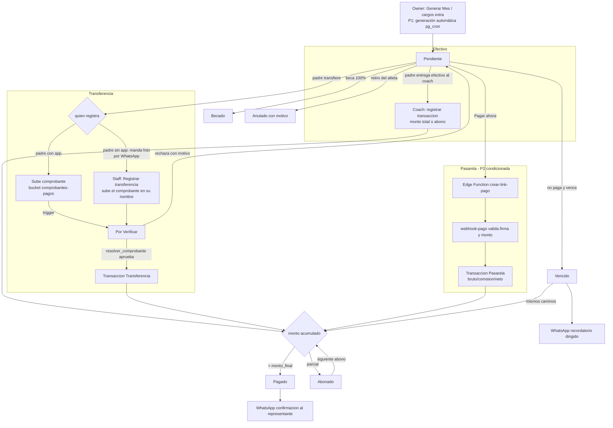

# Gestión de Pagos — Diseño Técnico

*Black Gold Basketball · Dashboard Premium · v27*
*Estado: planificación · Fecha: 2026-07-07*

---

## 1. Objetivo

Evolucionar el módulo de pagos actual —funcional pero mínimo y exclusivo del staff— hacia un **ciclo de cobro completo y visible para las familias**:

- Catálogo de servicios con tarifas por grupo, **categoría FEB (edad) y género**, además de la mensualidad por grupo que ya existe.
- Cargos extra individualizados por atleta (camps, uniformes, sesiones individuales, inscripciones).
- **Pagos parciales (abonos)** y registro por transacción — la realidad de un club pequeño, no el modelo binario pagado/pendiente.
- El padre viendo su **estado de cuenta real**, subiendo comprobantes de transferencia, y (fase posterior, condicionada) pagando por link de pasarela.
- El staff verificando comprobantes con un toque, **rindiendo cuentas del efectivo recaudado**, y pudiendo registrar todo en nombre de familias sin smartphone.
- Recordatorios de WhatsApp con **plantillas preconfiguradas y dirigidas al teléfono del representante** (no al selector de contactos), reutilizadas también por eventos y comunicaciones.

Este documento sigue el patrón de `docs/comunicaciones_eventos.md`: punto de partida real, modelo de datos (migración v27), flujos, y plan por fases. La fuente de verdad de seguridad sigue siendo `docs/plan_remediacion_seguridad.md` (v24 aplicada). El borrador pasó por revisión adversarial en tres lentes (producto, técnica, operativa/costos); las correcciones están incorporadas.

---

## 2. Punto de partida (lo que ya existe)

### 2.1 Servicio y UI de staff

Todo acceso a la tabla `pagos` **en `src/`** pasa por `src/api/pagosService.js`. (Ojo: tres scripts operativos también la tocan — `scripts/validar_rls_por_rol.js` la lee, y `scripts/reconciliar_pagos_precio_grupo.mjs` / `revertir_reconciliacion_pagos.mjs` **escriben pagos reales** — relevante para el UNIQUE nuevo de §3.1.) Sus seis funciones:

| Función | Qué hace | Consumidor |
|---|---|---|
| `fetchPagosMes(mes, anio, grupoNombre)` | SELECT con join `atletas!inner` (+`usuarios!inner!atletas_usuario_id_fkey`), filtro duro `tipo='Mensualidad'`; el filtro de grupo se hace **client-side** contra `atletas.grupo_nombre` | `AdminPagos.jsx` |
| `upsertPago(payload)` | Calcula `monto_final = monto_base * (1 - descuento_pct/100)`, upsert `onConflict: 'atleta_id,mes,anio,tipo'` | **Ninguno** (export muerto) |
| `marcarPagado(pagoId, {forma_pago, referencia_comprobante, notas})` | UPDATE a `estado='Pagado'` + `fecha_pago`; ya acepta referencia y notas, pero `AdminPagos.jsx` solo le pasa `forma_pago` | `AdminPagos.jsx` |
| `actualizarEstadoVencidos()` | UPDATE masivo Pendiente→Vencido por `fecha_vencimiento` | `AdminPagos.jsx` al montar (desde el cliente) |
| `generarPagosMensuales(mes, anio, atletas, registradoPor)` | Precio real desde `grupos_entrenamiento.precio_mensual` vía `atletas.grupo_id` (fallback $30), `estado='Becado'` si `es_becado`, vence el día 5, upsert `ignoreDuplicates` | `AdminPagos.jsx` ("Generar Mes") |
| `fetchHistorialPagosAtleta(atletaId)` | Últimos 24 pagos del atleta | **Ninguno** (export muerto) |

`AdminPagos.jsx` (ruta `/admin/pagos`, `AdminPagosPage.jsx`) ofrece: selector mes/año, filtro de grupo **hardcodeado** (`['Todos','Micro','Desarrollo','Elite']`, no lee grupos reales), "Generar Mes", stats en cliente, tabla por pago con "Marcar Pagado" (select inline `Efectivo/Transferencia/Otro`) y botón WhatsApp que abre `generarLinkWhatsApp('', ...)` — **con número vacío**: el coach elige el contacto a mano.

### 2.2 Portal del padre: maquetas, no datos

El padre hoy **no ve pagos reales**. `PadreDashboard.jsx` (~líneas 410-423) tiene un bloque literalmente comentado `{/* Pagos Pendientes Demo */}` con "Mensualidad Junio · Vencida hace 3 días · $30.00" hardcodeado y un botón "Enviar Comprobante al WhatsApp" **sin onClick**. `PortalPadreSeccion.jsx` (~líneas 123-132) muestra "Al Día · Próximo: 05/Jul" hardcodeado con la leyenda *"El coach no tiene acceso a esta información"* — leyenda **falsa**: la ruta admite rol `coach` (`main.jsx:133`) y la política `pagos_staff` de v24 le da `FOR ALL`. `padreService.js` no consulta pagos.

### 2.3 Esquema y RLS

- **`pagos`** (baseline líneas 552-573): `tipo` CHECK `('Mensualidad','Sesion Individual','Otro')`, `estado` CHECK `('Pagado','Pendiente','Vencido','Becado')`, `forma_pago` CHECK `('Efectivo','Transferencia','Make-Auto','Otro')` ('Make-Auto' es vestigio de Make.com), `monto_base/descuento_pct/monto_final`, `referencia_comprobante` (nunca se llena), `registrado_por`. Índices: **solo `pagos_pkey`**.
- **⚠ No existe `UNIQUE(atleta_id, mes, anio, tipo)`** en ninguna migración, pero los dos upserts lo asumen vía `onConflict`. O falla con 42P10 en producción, o existe creado a mano y hay drift de esquema. v27 lo corrige (§3.1).
- **Precios**: viven solo en `grupos_entrenamiento.precio_mensual` (y `precio_sesion_ind`, que **nada consume**). No hay catálogo de servicios ni tarifas por categoría/género.
- **RLS v24**: `pagos_staff` FOR ALL `es_staff()` (sin filtro por club — deuda declarada); `pagos_select_propio` FOR SELECT vía `mis_atletas()` — **el padre ya puede leer los pagos de sus hijos**; conectar su vista es solo frontend. El padre no puede escribir en `pagos`.
- **Datos de tarificación**: `usuarios.categoria_feb` es GENERATED STORED con `calcular_categoria_feb()` marcada IMMUTABLE aunque usa `age()` — **se congela al insertar** y se desactualiza al cumplir años. `usuarios.genero` es text libre DEFAULT 'Masculino' sin CHECK. Toda tarificación por edad debe calcular la categoría **al vuelo** sobre `fecha_nacimiento` (como ya hace `resolver_audiencia`).
- **Teléfonos**: `usuarios.telefono` (UNIQUE, además credencial de login y base de la cédula sintética `PADRE_<telefono>`) existe y se captura en registro, pero **ningún servicio de lectura lo selecciona** — por eso todos los wa.me van sin número.
- **Descuentos/becas**: `atletas.es_becado` (boolean — no hay media beca) y `atletas.descuento_pct` existen; `generarPagosMensuales` los aplica y `monto_final` se calcula en el cliente.
- **Vínculo familiar**: `padres_atletas` (N:M `padre_id`+`atleta_id`); un atleta puede tener dos representantes y un padre varios hijos. Precedente conocido: `atleta_grupo` (v18) nació vacía y hubo que poblarla — el flujo self-service del padre depende de que `padres_atletas` esté poblada y los padres registrados.

---

## 3. Modelo de datos — migración v27

Un solo archivo aditivo (`npx supabase migration new v27_pagos_servicios_transacciones`), aplicado con `npx supabase db push`. Convenciones del repo: `IF NOT EXISTS`, CHECKs recreados con `DROP CONSTRAINT IF EXISTS` + `ADD`, RLS estilo v24 con los helpers `es_staff()`, `current_usuario_id()`, `current_user_rol()`, `mis_atletas()`, `current_user_club()`. **La parte de Storage va en un paso separado** (§3.5) porque puede no ser aplicable vía `db push`.

> **Prerrequisitos de datos (script previo en `Dashboard_Premium/scripts/`, con backup JSON, patrón de `reconciliar_pagos_precio_grupo.mjs`):**
> 1. Detectar duplicados existentes de `(atleta_id, mes, anio, tipo)` — el UNIQUE de §3.1 no se puede crear si los hay.
> 2. Sanear `usuarios.genero` (texto libre con DEFAULT 'Masculino' que pudo sesgar registros históricos) — el CHECK de §3.2 se agrega `NOT VALID` y se valida después del saneo.

### 3.1 Integridad primero: el UNIQUE que falta

```sql
-- Respalda los onConflict existentes de pagosService.js.
-- Las mensualidades llevan mes/anio; los cargos extra (v27) llevan mes/anio NULL
-- + fecha_servicio, y como NULLs son distintos en UNIQUE, no colisionan entre sí.
CREATE UNIQUE INDEX IF NOT EXISTS pagos_atleta_mes_anio_tipo_key
  ON public.pagos (atleta_id, mes, anio, tipo);
```

### 3.2 Catálogo de servicios y tarifas por grupo / categoría FEB / género

```sql
CREATE TABLE IF NOT EXISTS public.catalogo_servicios (
  id           uuid PRIMARY KEY DEFAULT gen_random_uuid(),
  club         text NOT NULL DEFAULT 'Black Gold',
  nombre       text NOT NULL,                -- 'Mensualidad', 'Sesión Individual', 'Small Ball Camp', 'Uniforme', 'Inscripción torneo'...
  descripcion  text,
  recurrencia  text NOT NULL DEFAULT 'puntual' CHECK (recurrencia IN ('mensual','puntual')),
  precio_base  numeric(10,2) NOT NULL DEFAULT 0,
  activo       boolean NOT NULL DEFAULT true,
  created_at   timestamptz DEFAULT now(),
  updated_at   timestamptz DEFAULT now(),
  UNIQUE (club, nombre)
);

-- Reglas de precio por dimensión. NULL = "cualquiera" en esa dimensión.
CREATE TABLE IF NOT EXISTS public.servicio_tarifas (
  id            uuid PRIMARY KEY DEFAULT gen_random_uuid(),
  servicio_id   uuid NOT NULL REFERENCES public.catalogo_servicios(id) ON DELETE CASCADE,
  grupo_id      uuid REFERENCES public.grupos_entrenamiento(id),
  categoria_feb text,   -- valores de calcularCategoriaFEB(): 'Premini (Sub-9)' ... 'Mayores'
  genero        text CHECK (genero IN ('Masculino','Femenino')),
  precio        numeric(10,2) NOT NULL,
  vigente_desde date NOT NULL DEFAULT current_date,
  created_at    timestamptz DEFAULT now()
);
CREATE UNIQUE INDEX IF NOT EXISTS servicio_tarifas_dim_key
  ON public.servicio_tarifas (servicio_id, COALESCE(grupo_id::text,'*'),
                              COALESCE(categoria_feb,'*'), COALESCE(genero,'*'), vigente_desde);
```

**Resolución de precio** — categoría **al vuelo** (nunca la columna STORED desactualizada), con precedencia determinista por campos separados (no por suma de especificidades, que empata):

```sql
CREATE OR REPLACE FUNCTION public.precio_servicio_atleta(p_servicio_id uuid, p_atleta_id uuid)
RETURNS numeric LANGUAGE sql STABLE SECURITY DEFINER SET search_path = public AS $$
  WITH persona AS (
    SELECT a.grupo_id, calcular_categoria_feb(u.fecha_nacimiento) AS cat, u.genero
    FROM atletas a JOIN usuarios u ON u.id = a.usuario_id
    WHERE a.id = p_atleta_id
  )
  SELECT COALESCE(
    (SELECT t.precio FROM servicio_tarifas t, persona p
      WHERE t.servicio_id = p_servicio_id AND t.vigente_desde <= current_date
        AND (t.grupo_id      IS NULL OR t.grupo_id      = p.grupo_id)
        AND (t.categoria_feb IS NULL OR t.categoria_feb = p.cat)
        AND (t.genero        IS NULL OR t.genero        = p.genero)
      ORDER BY (t.grupo_id IS NOT NULL) DESC,
               (t.categoria_feb IS NOT NULL) DESC,
               (t.genero IS NOT NULL) DESC,
               t.vigente_desde DESC
      LIMIT 1),
    (SELECT precio_base FROM catalogo_servicios WHERE id = p_servicio_id)
  );
$$;

-- v24 revocó los privilegios default de anon sobre TABLAS pero no sobre FUNCIONES
-- (el baseline tiene GRANT ALL ON FUNCTIONS TO anon por default privileges).
-- Toda función nueva de v27 repite este bloque:
REVOKE ALL ON FUNCTION public.precio_servicio_atleta(uuid, uuid) FROM PUBLIC, anon;
GRANT EXECUTE ON FUNCTION public.precio_servicio_atleta(uuid, uuid) TO authenticated, service_role;
```

**Precedencia con el precio por grupo existente** (no se rompe nada): para *Mensualidad*, `grupos_entrenamiento.precio_mensual` **sigue mandando** cuando el atleta tiene grupo (es lo que `generarPagosMensuales` ya hace); el catálogo cubre el fallback (reemplaza el `FALLBACK_MONTO_BASE = 30` hardcodeado) y todos los servicios no-mensualidad. A mediano plazo `precio_mensual` migra al catálogo como tarifa con `grupo_id` para tener **una sola fuente de precios** — hasta entonces la dualidad queda declarada aquí. La migración siembra dos filas por club: `Mensualidad` (mensual) y `Sesión Individual` (puntual, `precio_base` tomado de `precio_sesion_ind` — por fin con consumidor).

**CHECK de género** (tras el saneo del prerrequisito):

```sql
ALTER TABLE public.usuarios DROP CONSTRAINT IF EXISTS usuarios_genero_check;
ALTER TABLE public.usuarios ADD CONSTRAINT usuarios_genero_check
  CHECK (genero IS NULL OR genero IN ('Masculino','Femenino')) NOT VALID;
-- ALTER TABLE public.usuarios VALIDATE CONSTRAINT usuarios_genero_check;  -- tras el saneo
```

### 3.3 Transacciones (abonos), ampliación de `pagos` y becas parciales

**El cambio de fondo respecto al módulo actual**: el pago deja de ser binario. Cada entrega de dinero —efectivo parcial, transferencia, pasarela— es una fila de `pago_transacciones`. Esto habilita a la vez: abonos ("$15 hoy, $15 la otra semana", la norma en el club), **arqueo de efectivo por coach** (suma de transacciones Efectivo por `registrado_por` y periodo), y conciliación de pasarela (bruto/comisión/neto).

```sql
CREATE TABLE IF NOT EXISTS public.pago_transacciones (
  id             uuid PRIMARY KEY DEFAULT gen_random_uuid(),
  pago_id        uuid NOT NULL REFERENCES public.pagos(id) ON DELETE CASCADE,
  monto          numeric(10,2) NOT NULL CHECK (monto > 0),
  forma_pago     text NOT NULL CHECK (forma_pago IN ('Efectivo','Transferencia','Pasarela','Otro')),
  referencia     text,                      -- nº documento de transferencia / id de transacción de pasarela
  comprobante_id uuid,                      -- FK a pago_comprobantes (se añade tras crearla, §3.4)
  monto_bruto    numeric(10,2),             -- pasarela: lo que pagó el padre
  comision       numeric(10,2),             -- pasarela: comisión retenida (monto = neto)
  registrado_por uuid NOT NULL REFERENCES public.usuarios(id),
  notas          text,
  created_at     timestamptz DEFAULT now()
);
CREATE INDEX IF NOT EXISTS idx_pago_transacciones_pago ON public.pago_transacciones(pago_id);
CREATE INDEX IF NOT EXISTS idx_pago_transacciones_registrador
  ON public.pago_transacciones(registrado_por, forma_pago, created_at);
```

Un trigger `AFTER INSERT/DELETE ON pago_transacciones` recalcula en `pagos`: `monto_pagado = SUM(monto)`, y `estado`: `'Pagado'` si `monto_pagado >= monto_final` (fija `fecha_pago` y `forma_pago` de la última transacción), `'Abonado'` si `0 < monto_pagado < monto_final`. Al quedar `'Pagado'`, los comprobantes aún `'pendiente'` del pago pasan a `'obsoleto'` (evita el contador "Por verificar" inflado cuando el padre subió comprobante y luego pagó en efectivo).

```sql
ALTER TABLE public.pagos ADD COLUMN IF NOT EXISTS monto_pagado       numeric(10,2) NOT NULL DEFAULT 0;
ALTER TABLE public.pagos ADD COLUMN IF NOT EXISTS servicio_id        uuid REFERENCES public.catalogo_servicios(id);
ALTER TABLE public.pagos ADD COLUMN IF NOT EXISTS concepto           text;      -- texto del cargo ('Camp julio', 'Uniforme talla M')
ALTER TABLE public.pagos ADD COLUMN IF NOT EXISTS fecha_servicio     date;      -- cargos puntuales (mes/anio quedan NULL)
ALTER TABLE public.pagos ADD COLUMN IF NOT EXISTS comprobante_path   text;      -- comprobante vigente (atajo de UI)
ALTER TABLE public.pagos ADD COLUMN IF NOT EXISTS verificado_por     uuid REFERENCES public.usuarios(id);
ALTER TABLE public.pagos ADD COLUMN IF NOT EXISTS verificado_at      timestamptz;
ALTER TABLE public.pagos ADD COLUMN IF NOT EXISTS anulado_motivo     text;
-- Pasarela (contrato interno estable aunque la integración sea P2)
ALTER TABLE public.pagos ADD COLUMN IF NOT EXISTS pasarela           text;      -- 'payphone' | 'deuna' | ...
ALTER TABLE public.pagos ADD COLUMN IF NOT EXISTS referencia_externa text;      -- id de transacción (idempotencia de webhook)
ALTER TABLE public.pagos ADD COLUMN IF NOT EXISTS link_pago          text;

CREATE UNIQUE INDEX IF NOT EXISTS pagos_referencia_externa_key
  ON public.pagos (pasarela, referencia_externa) WHERE referencia_externa IS NOT NULL;

ALTER TABLE public.pagos DROP CONSTRAINT IF EXISTS pagos_estado_check;
ALTER TABLE public.pagos ADD CONSTRAINT pagos_estado_check
  CHECK (estado IN ('Pagado','Pendiente','Vencido','Becado','Por Verificar','Abonado','Anulado'));

ALTER TABLE public.pagos DROP CONSTRAINT IF EXISTS pagos_forma_pago_check;
ALTER TABLE public.pagos ADD CONSTRAINT pagos_forma_pago_check
  CHECK (forma_pago IN ('Efectivo','Transferencia','Pasarela','Make-Auto','Otro'));
```

- **`'Anulado'`** (con `anulado_motivo`) aplica tanto a cargos extra creados por error como a **mensualidades de atletas que se retiran** — se excluye de métricas de morosidad y de recordatorios, y **nunca se borra la fila** (auditoría). Reemplaza el "borrar si no tiene comprobantes" del borrador.
- **Becas parciales**: `es_becado` boolean no expresa la media beca (lo más común). v27 añade `atletas.beca_pct integer NOT NULL DEFAULT 0` (backfill `SET beca_pct = 100 WHERE es_becado`). `estado='Becado'` queda solo para 100%; beca parcial = pago `Pendiente` con monto reducido y etiqueta "Beca 50%" visible para el padre y para el panel de cobertura de becas. `es_becado` queda como columna legada de lectura.
- **Representante de pagos y pausa de recordatorios**:

```sql
ALTER TABLE public.padres_atletas ADD COLUMN IF NOT EXISTS es_rep_pagos boolean NOT NULL DEFAULT false;
CREATE UNIQUE INDEX IF NOT EXISTS padres_atletas_rep_pagos_key
  ON public.padres_atletas (atleta_id) WHERE es_rep_pagos;

ALTER TABLE public.atletas ADD COLUMN IF NOT EXISTS recordatorios_pausados boolean NOT NULL DEFAULT false;
ALTER TABLE public.atletas ADD COLUMN IF NOT EXISTS recordatorios_pausados_motivo text;
```

Con dos representantes (N:M real en `padres_atletas`), los recordatorios y confirmaciones van al `es_rep_pagos` (o al único vínculo si solo hay uno); mandar la deuda al representante equivocado en una familia separada es un problema social real. `recordatorios_pausados` respeta los acuerdos verbales del club ("me pagas cuando cobres") frente a cualquier recordatorio manual masivo o automático futuro. **Caso atleta adulto (Mayores) sin representante**: `mis_atletas()` ya incluye la propia fila del atleta-usuario; el estado de cuenta y las plantillas usan "tu mensualidad" en vez de "la mensualidad de {nombre}" cuando el destinatario es el propio atleta.

Un **cargo extra** es una fila de `pagos` con `tipo='Otro'` (o `'Sesion Individual'`), `servicio_id` + `concepto`, `mes/anio` NULL y `fecha_servicio`/`fecha_vencimiento` puntuales, creada por `crearCargo()` (INSERT normal — el UNIQUE de §3.1 no le aplica porque `mes/anio` son NULL).

### 3.4 Comprobantes de transferencia

```sql
CREATE TABLE IF NOT EXISTS public.pago_comprobantes (
  id                  uuid PRIMARY KEY DEFAULT gen_random_uuid(),
  pago_id             uuid NOT NULL REFERENCES public.pagos(id) ON DELETE CASCADE,
  subido_por          uuid NOT NULL REFERENCES public.usuarios(id),
  storage_path        text NOT NULL,          -- '<atleta_id>/<pago_id>/<timestamp>.jpg'
  banco               text,
  numero_documento    text,
  monto_declarado     numeric(10,2),
  fecha_transferencia date,
  estado              text NOT NULL DEFAULT 'pendiente'
                      CHECK (estado IN ('pendiente','aprobado','rechazado','obsoleto')),
  revisado_por        uuid REFERENCES public.usuarios(id),
  revisado_at         timestamptz,
  motivo_rechazo      text,
  created_at          timestamptz DEFAULT now()
);
CREATE INDEX IF NOT EXISTS idx_pago_comprobantes_pago ON public.pago_comprobantes(pago_id);

ALTER TABLE public.pago_transacciones
  ADD CONSTRAINT pago_transacciones_comprobante_fk
  FOREIGN KEY (comprobante_id) REFERENCES public.pago_comprobantes(id);
```

El padre **no** escribe en `pagos` (se mantiene v24). Al insertar un comprobante, un trigger pasa el pago a `'Por Verificar'` (solo desde `Pendiente`/`Vencido`/`Abonado`; sobre un pago `Becado` o `Pagado` la inserción se rechaza en el trigger, no solo en UI). La resolución del staff es una RPC que valida estado previo y **crea la transacción** (unifica con los abonos):

```sql
CREATE OR REPLACE FUNCTION public.resolver_comprobante(p_comprobante_id uuid, p_aprobar boolean, p_motivo text DEFAULT NULL)
RETURNS void LANGUAGE plpgsql SECURITY DEFINER SET search_path = public AS $$
DECLARE v_pago uuid; v_monto numeric;
BEGIN
  IF NOT es_staff() THEN RAISE EXCEPTION 'solo staff'; END IF;
  UPDATE pago_comprobantes
     SET estado = CASE WHEN p_aprobar THEN 'aprobado' ELSE 'rechazado' END,
         revisado_por = current_usuario_id(), revisado_at = now(), motivo_rechazo = p_motivo
   WHERE id = p_comprobante_id AND estado = 'pendiente'
   RETURNING pago_id, monto_declarado INTO v_pago, v_monto;
  IF v_pago IS NULL THEN RAISE EXCEPTION 'comprobante inexistente o ya resuelto'; END IF;

  IF p_aprobar THEN
    INSERT INTO pago_transacciones (pago_id, monto, forma_pago, comprobante_id, referencia, registrado_por)
    SELECT v_pago,
           COALESCE(v_monto, p.monto_final - p.monto_pagado),  -- monto declarado, o el saldo
           'Transferencia', p_comprobante_id, c.numero_documento, current_usuario_id()
    FROM pagos p, pago_comprobantes c WHERE p.id = v_pago AND c.id = p_comprobante_id;
    -- el trigger de transacciones recalcula monto_pagado/estado (Pagado o Abonado)
  ELSE
    UPDATE pagos SET comprobante_path = NULL,
           estado = CASE WHEN monto_pagado > 0 THEN 'Abonado'
                         WHEN fecha_vencimiento < current_date THEN 'Vencido'
                         ELSE 'Pendiente' END
     WHERE id = v_pago AND estado = 'Por Verificar';
  END IF;
END; $$;
-- + bloque REVOKE/GRANT como en §3.2
```

Nótese que la aprobación con `monto_declarado` menor al saldo produce un **abono por transferencia** — el mismo modelo cubre "transferí la mitad".

### 3.5 Storage (paso separado — puede no aplicar vía `db push`)

⚠️ **Riesgo verificado**: en proyectos Supabase actuales el rol `postgres` (con el que corre `npx supabase db push`) no siempre es owner de `storage.objects` (lo es `supabase_storage_admin`), y `CREATE POLICY ... ON storage.objects` puede fallar con *must be owner of table objects*, **bloqueando el archivo de migración completo**. El repo no usa Storage hoy (cero precedente). Por eso: bucket y políticas van en **su propio archivo de migración** (si el push falla, se crean por el dashboard/Storage API y el archivo se marca como aplicado) y jamás dentro del v27 principal.

```sql
INSERT INTO storage.buckets (id, name, public, file_size_limit, allowed_mime_types)
VALUES ('comprobantes-pagos','comprobantes-pagos', false,
        5242880,  -- 5 MB
        ARRAY['image/jpeg','image/png','image/webp','application/pdf'])
ON CONFLICT (id) DO NOTHING;

-- Políticas separadas (staff y familia): evita que un path no-UUID rompa la
-- evaluación para staff (el cast ::uuid dentro de un OR no cortocircuita).
CREATE POLICY comprobantes_staff_all ON storage.objects FOR ALL TO authenticated
  USING (bucket_id = 'comprobantes-pagos' AND public.es_staff())
  WITH CHECK (bucket_id = 'comprobantes-pagos' AND public.es_staff());

CREATE POLICY comprobantes_familia_select ON storage.objects FOR SELECT TO authenticated
  USING (bucket_id = 'comprobantes-pagos'
    AND name ~ '^[0-9a-f]{8}-[0-9a-f]{4}-[0-9a-f]{4}-[0-9a-f]{4}-[0-9a-f]{12}/'
    AND (split_part(name,'/',1))::uuid IN (SELECT unnest(public.mis_atletas())));

CREATE POLICY comprobantes_familia_insert ON storage.objects FOR INSERT TO authenticated
  WITH CHECK (bucket_id = 'comprobantes-pagos'
    AND name ~ '^[0-9a-f]{8}-[0-9a-f]{4}-[0-9a-f]{4}-[0-9a-f]{4}-[0-9a-f]{12}/'
    AND (split_part(name,'/',1))::uuid IN (SELECT unnest(public.mis_atletas())));
```

**Retención (PII financiera de familias y menores)**: los comprobantes aprobados se conservan 24 meses y luego se borra la **imagen** (los metadatos de `pago_comprobantes` y la transacción quedan para siempre). Job manual/anual al inicio; automatizable después.

### 3.6 Configuración por club

Hoy el número del club vive en la env var de build `VITE_COACH_WHATSAPP` y el día de vencimiento (5) y el fallback de precio están hardcodeados. v27 los lleva a datos:

```sql
CREATE TABLE IF NOT EXISTS public.club_config (
  club                    text PRIMARY KEY,
  whatsapp_club           text,               -- E.164 sin '+' (593...)
  cuenta_bancaria_texto   text,               -- instrucciones de transferencia que ve el padre
  qr_deuna_path           text,               -- imagen del QR De Una (Storage, bucket público o el mismo)
  dia_vencimiento         integer NOT NULL DEFAULT 5,
  descuento_hermanos_pct  integer NOT NULL DEFAULT 0,   -- aplica del 2º hermano en adelante, a la(s) mensualidad(es) más baratas
  pasarela                text,               -- 'payphone' | NULL
  updated_at              timestamptz DEFAULT now()
);
INSERT INTO public.club_config (club) VALUES ('Black Gold') ON CONFLICT DO NOTHING;
```

Las credenciales de pasarela/Meta **no** van aquí: van en secretos de Edge Function (`supabase secrets set`), nunca en tablas ni en el cliente.

### 3.7 RLS de las tablas nuevas

**Corrección clave sobre el borrador**: `es_staff()` incluye al coach. La configuración del club (¡la cuenta bancaria a la que transfieren las familias!), el catálogo y las tarifas los escribe **solo owner/superadmin** — dejarlo en `es_staff()` sería exactamente la "barrera cosmética" que este diseño elimina en §7.4, y un vector de fraude directo.

```sql
ALTER TABLE public.catalogo_servicios ENABLE ROW LEVEL SECURITY;
ALTER TABLE public.servicio_tarifas   ENABLE ROW LEVEL SECURITY;
ALTER TABLE public.pago_transacciones ENABLE ROW LEVEL SECURITY;
ALTER TABLE public.pago_comprobantes  ENABLE ROW LEVEL SECURITY;
ALTER TABLE public.club_config        ENABLE ROW LEVEL SECURITY;

-- Catálogo/tarifas/config: los autenticados del club leen (el padre ve precios e
-- instrucciones de pago); escribe SOLO owner/superadmin.
CREATE POLICY servicios_select ON public.catalogo_servicios FOR SELECT TO authenticated
  USING (club = current_user_club() OR es_superadmin());
CREATE POLICY servicios_write ON public.catalogo_servicios FOR ALL TO authenticated
  USING ((SELECT current_user_rol()) IN ('owner','superadmin'))
  WITH CHECK ((SELECT current_user_rol()) IN ('owner','superadmin'));

CREATE POLICY tarifas_select ON public.servicio_tarifas FOR SELECT TO authenticated
  USING (servicio_id IN (SELECT id FROM catalogo_servicios WHERE club = current_user_club())
         OR es_superadmin());
CREATE POLICY tarifas_write ON public.servicio_tarifas FOR ALL TO authenticated
  USING ((SELECT current_user_rol()) IN ('owner','superadmin'))
  WITH CHECK ((SELECT current_user_rol()) IN ('owner','superadmin'));

CREATE POLICY club_config_select ON public.club_config FOR SELECT TO authenticated
  USING (club = current_user_club() OR es_superadmin());
CREATE POLICY club_config_write ON public.club_config FOR ALL TO authenticated
  USING ((SELECT current_user_rol()) IN ('owner','superadmin'))
  WITH CHECK ((SELECT current_user_rol()) IN ('owner','superadmin'));

-- Transacciones: staff registra y lee; la familia lee las de sus pagos.
CREATE POLICY transacciones_staff ON public.pago_transacciones FOR ALL TO authenticated
  USING (es_staff()) WITH CHECK (es_staff() AND registrado_por = current_usuario_id());
CREATE POLICY transacciones_select_propio ON public.pago_transacciones FOR SELECT TO authenticated
  USING (pago_id IN (SELECT p.id FROM pagos p WHERE p.atleta_id IN (SELECT unnest(mis_atletas()))));

-- Comprobantes: staff todo; padre/atleta lee e inserta SOLO sobre pagos de los suyos.
CREATE POLICY comprobantes_staff ON public.pago_comprobantes FOR ALL TO authenticated
  USING (es_staff()) WITH CHECK (es_staff());
CREATE POLICY comprobantes_select_propio ON public.pago_comprobantes FOR SELECT TO authenticated
  USING (pago_id IN (SELECT p.id FROM pagos p WHERE p.atleta_id IN (SELECT unnest(mis_atletas()))));
CREATE POLICY comprobantes_insert_propio ON public.pago_comprobantes FOR INSERT TO authenticated
  WITH CHECK (subido_por = current_usuario_id()
    AND pago_id IN (SELECT p.id FROM pagos p WHERE p.atleta_id IN (SELECT unnest(mis_atletas()))));
```

**Criterio de aceptación de v27**: extender `scripts/validar_rls_por_rol.js` (que ya prueba `pagos`) a las cuatro tablas nuevas y al bucket.

**Deuda heredada declarada**: `pagos_staff` sigue sin filtro por club (igual que v24; aceptable con un club real operando — cerrar antes de dar de alta un segundo club, Fase 3 del plan de seguridad).

### 3.8 Jobs programados (pg_cron)

Dos UPDATE masivos no deben depender de que alguien abra una página: marcar vencidos y **generar las mensualidades del mes** (si el owner olvida "Generar Mes", no hay pendientes, no hay recordatorios, y el ciclo se detiene en silencio). SQL concreto (no un enunciado):

```sql
CREATE EXTENSION IF NOT EXISTS pg_cron;

CREATE OR REPLACE FUNCTION public.marcar_pagos_vencidos()
RETURNS void LANGUAGE sql SECURITY DEFINER SET search_path = public AS $$
  UPDATE pagos SET estado = 'Vencido'
  WHERE estado IN ('Pendiente','Abonado') AND fecha_vencimiento < current_date;
$$;
-- (la generación mensual server-side es una función espejo de generarPagosMensuales;
--  entra en P1 — hasta entonces "Generar Mes" sigue siendo el gesto manual del owner)

SELECT cron.schedule('marcar-pagos-vencidos', '15 5 * * *',
                     $$SELECT public.marcar_pagos_vencidos()$$);
-- + REVOKE/GRANT como en §3.2
```

> Nota: un pago `Abonado` vencido pasa a `Vencido` conservando `monto_pagado` — el saldo restante es lo exigible. Si `pg_cron` no estuviera disponible en el plan del proyecto, el respaldo es conservar la llamada idempotente al montar AdminPagos (lo de hoy), nunca un cron externo con credenciales.

---

## 4. Flujo de gestión: atleta/padre → coach → club

### 4.1 Diagrama



### 4.2 Escenario (a): efectivo entregado al coach — con rendición de cuentas

1. El padre entrega efectivo al coach en el entrenamiento (la realidad operativa número uno).
2. El coach abre `/admin/pagos` en **modo cobro** (§7.4), busca al atleta y registra la transacción: monto (total **o abono**), forma `Efectivo`, nota opcional ("entregado en cancha 05/07"). La fila queda `Pagado` o `Abonado $15 de $30`.
3. **Arqueo**: el panel del owner muestra "efectivo recaudado por registrador y periodo" (suma de `pago_transacciones` con `forma_pago='Efectivo'` agrupada por `registrado_por`). La entrega física coach→owner se concilia contra ese número — la discrepancia entre efectivo marcado y efectivo entregado es la fuente nº 1 de conflictos en clubes reales, y aquí deja de ser invisible. Un "cierre de caja" formal (registro de cada entrega) entra en P1.
4. El botón WhatsApp de la fila cambia a "Enviar confirmación" (plantilla `confirmacion_pago` o `abono_registrado`), dirigida al teléfono del representante de pagos. **El estado en el portal del padre es el recibo canónico** — la confirmación por WhatsApp es cortesía manual hasta W3 (§6.5), no una promesa.
5. Conectividad de cancha: si falla el registro por señal, el coach reintenta al salir — las transacciones son INSERT simples e idempotentes por UX (la fila muestra el estado actual antes de registrar). Una cola offline formal queda fuera de alcance (deuda declarada de la PWA).

### 4.3 Escenario (b): transferencia + comprobante

**Camino self-service** (padre con la app):
1. El padre ve en su portal la mensualidad `Pendiente` con `monto_final` real (desglose del descuento si aplica) y las instrucciones de transferencia + QR De Una (`club_config`).
2. Transfiere y toca **"Subir comprobante"**: foto → Storage (`<atleta_id>/<pago_id>/<ts>.jpg`) + INSERT en `pago_comprobantes` (banco, nº documento, monto declarado — puede ser parcial —, fecha). El trigger pasa el pago a `Por Verificar`; el padre ve el badge ámbar "En verificación" y puede avisar al club con un toque (plantilla corta hacia `whatsapp_club`).
3. El staff ve el contador **"Por verificar (N)"**, abre el visor (imagen con `createSignedUrl` de vida corta, monto declarado vs. saldo, otros comprobantes con el mismo nº de documento — detecta la transferencia compartida entre hermanos) y toca **Aprobar** o **Rechazar con motivo**. Aprobar crea la transacción (total → `Pagado`; parcial → `Abonado`); rechazar devuelve el estado y el padre ve el motivo accionable ("la foto no se lee", "el monto no coincide").

**Camino asistido** (padre sin smartphone/datos/cuenta — imprescindible, no opcional): el padre manda la foto por WhatsApp al club, como hoy. El staff usa **"Registrar transferencia"** en la fila del pago: sube esa imagen al mismo bucket, se crea el comprobante ya `aprobado` y su transacción en un solo paso. Sin este camino, la pestaña "Por verificar" quedaría vacía y el club seguiría operando exactamente como hoy pero con más pantallas.

> **Prerrequisito operativo declarado**: el flujo self-service depende de `padres_atletas` poblada y de padres registrados (precedente: `atleta_grupo` nació vacía en v18). El plan P0 incluye una tarea de poblado + campaña de registro, y la métrica de adopción (% de comprobantes que entran self-service vs. asistidos) decide cuánto invertir en el camino del padre.

### 4.4 Escenario (c): link de pasarela (P2 — hipótesis condicionada, §5)

1. El owner activa `club_config.pasarela` y los secretos de la Edge Function; prerrequisito: formalización SRI (§5.3).
2. El padre toca **"Pagar ahora"**: la Edge Function `crear-link-pago` (service_role) lee **`monto_final - monto_pagado` de la fila de `pagos`** como fuente única del monto (nunca el catálogo — el catálogo sugiere precios al crear cargos, el pago concreto ya tiene descuentos aplicados), crea el link y lo guarda (`link_pago`, `pasarela`, `referencia_externa`).
3. El **webhook** `webhook-pago` (Edge Function con `verify_jwt = false` en `config.toml` — los webhooks externos no traen JWT de Supabase) valida la firma, busca por `referencia_externa` (índice único parcial = idempotencia) y **valida que el monto pagado coincida con el saldo**: coincide → transacción `Pasarela` con `monto_bruto`/`comision`/neto; no coincide (link viejo tras cambio de tarifa, pago parcial inesperado) → `Por Verificar` + alerta al staff, nunca `Pagado` automático. Así el extracto bancario (neto) cuadra contra el dashboard.
4. Pendiente de verificación al contratar: si Payphone ofrece callback server-to-server real o solo redirect + API de confirmación — cambia el detalle de implementación del webhook, no el contrato de datos.

### 4.5 Casos borde

- **Becados**: beca 100% = fila `Becado` (visible en panel para control de cobertura, excluida de "Por Cobrar"; su portal muestra "Cubierto por beca 🖤💛", nunca botón de pago). **Media beca** = `beca_pct` reduce el monto y el pago sigue el ciclo normal con etiqueta. Cargos extra a becados: el staff decide por cargo si aplica la beca.
- **Descuento por hermanos**: hermanos = atletas que comparten un representante en `padres_atletas`. Dos fragilidades resueltas: (1) si mamá registró a un hijo y papá al otro, el staff los agrupa vinculando al mismo representante (o marcando `es_rep_pagos` común) — el agrupador es editable, no inferido ciegamente; (2) la regla es determinista y comunicable: el descuento (`descuento_hermanos_pct`, `GREATEST` con el individual, no acumulado) aplica **a la(s) mensualidad(es) de menor precio** del grupo familiar (no "por orden de creación" — `atletas` ni siquiera tiene `created_at`). El origen queda en `pagos.notas` ("desc. hermanos 10%").
- **Pago adelantado**: "Generar Mes" acepta generar un mes futuro para un atleta concreto (el padre que paga julio+agosto de una vez tiene contra qué pagar). Saldo a favor / sobrepago genérico queda para v26 — hasta entonces, el sobrepago se registra como transacción del mes siguiente generado al momento.
- **Alta a mitad de mes**: política explícita en el catálogo — el primer mes se cobra completo o prorrateado por semanas según decida el owner (decisión de producto pendiente, §10); lo que no puede pasar es que quede a criterio de cada coach. Matrícula/inscripción inicial = cargo extra del catálogo.
- **Retiro del atleta**: la mensualidad ya generada se **anula con motivo** ("retiro 12/07") — no queda `Vencida` inflando la morosidad ni recibiendo recordatorios eternos.
- **Comprobante duplicado / doble camino**: pago ya `Pagado` no acepta comprobantes (trigger); si el padre subió comprobante y luego pagó en efectivo, al quedar `Pagado` los comprobantes `pendiente` pasan a `obsoleto` automáticamente.
- **Deshacer un registro erróneo**: `revertirTransaccion(transaccionId, motivo)` (staff) borra/contramarca la transacción y el trigger recalcula el estado; el motivo queda en `notas`. La bitácora formal de auditoría (tabla `pagos_auditoria`) entra en P2 — hasta entonces `pago_transacciones` ya es en sí un registro de quién cobró qué y cuándo, que es el 80% del valor.
- **Moras/recargos**: fuera de alcance en v27 (decisión de producto pendiente); el modelo lo admite después como cargo extra `concepto='Recargo por mora'`.

---

## 5. Pasarelas de pago en Ecuador

### 5.1 Comparativa

⚠️ Corrección importante sobre versiones anteriores de esta tabla: la comisión de Payphone **no** es ~0%; es **5% + IVA por venta con tarjeta (≈5,75% efectivo)**, confirmado en su centro de soporte oficial (help.payphone.app, "¿Cuánto cuesta Payphone?"). Lo gratuito es solo la transferencia saldo Payphone→Payphone, marginal para familias que pagarán con tarjeta. Las cifras de Kushki/PlacetoPay/Datafast provienen de fuentes secundarias (blogs de agencias) — **confirmar en tarifarios oficiales antes de contratar**.

| Pasarela | Comisión | Requisitos | Integración | Ajuste al club |
|---|---|---|---|---|
| **Payphone** | **5% + IVA por venta con tarjeta (≈5,75%)**; sin mensualidad; puede trasladarse al pagador | Persona natural o jurídica **con RUC** | Links de pago compartibles por WhatsApp; botón web; confirmación vía API (verificar callback real) | Técnicamente el mejor encaje, pero la comisión y el RUC cambian la ecuación (§5.2) |
| **De Una (Banco Pichincha)** | Sin costo visible para el cobrador en QR/transferencia (verificar condiciones de cuenta de negocio) | Cuenta en Banco Pichincha; aclarar titularidad (§5.3) | QR estático como imagen en el portal; sin webhook para terceros → sigue necesitando comprobante | **Alto como método manual**: adopción masiva en Ecuador, costo cero |
| **Kushki** | ~2,95% + $0,25/transacción (fuente secundaria, negociable) | Persona jurídica, aprobación de comercio | SDK/API + webhooks formales | Sobredimensionado para un club de una sede |
| **PlaceToPay (Evertec)** | Negociada (fuente secundaria) | Convenio con banco adquirente | Checkout redirect + webhook | Medio-bajo a esta escala |
| **Datafast** | Negociada con banco | Persona jurídica, trámite bancario | Integración con QA bancario (días) | Bajo a esta escala |
| **Transferencia + comprobante (statu quo)** | **$0** | Cuenta bancaria | Ya diseñada en §4.3 | **El caballo de batalla** — probablemente cubre >90% de cobros no-efectivo |

Con mensualidades de $20-60, la comisión Payphone son $1,15-$3,45 por pago; con ~40 familias y 50% de adopción, **$35-70/mes que alguien debe absorber** — el club (merma ~5,75% de esos ingresos) o el padre (recargo visible que desincentiva el canal). Esa decisión es previa a cualquier integración (§10).

### 5.2 Recomendación en fases

- **Fase 0 (ya, sin contrato, costo $0)**: transferencia bancaria + **QR De Una** como imagen en el portal + flujo de comprobantes de §4.3 (self-service y asistido). Es probable que esta fase sea suficiente **indefinidamente** a la escala actual.
- **Pasarela (P2) — hipótesis, no compromiso**: lanzar P0+P1, medir 2-3 meses qué fracción de cobros llega por cada canal y **cuántas familias piden pagar con tarjeta**. Umbral orientativo para activarla: ≥8-10 familias/mes pidiéndolo de forma sostenida. El contrato interno de esquema (`pasarela`, `referencia_externa`, `link_pago`, transacciones con bruto/comisión/neto) ya queda listo en v27 sin costo — es el argumento para **no** apurar la integración.
- **Si escala multi-club/volumen**: renegociar (Kushki/PlaceToPay) manteniendo el mismo contrato interno para que el cambio de proveedor no toque el esquema.

### 5.3 Prerrequisitos de formalización (condición de entrada a P2)

Cobrar por pasarela formaliza al club ante el SRI, y eso tiene costos propios que este diseño no esconde:

- **RUC**: Payphone lo exige. ¿El club/owner lo tiene? ¿Persona natural o jurídica? La cuenta receptora debería ser **del club, no personal del owner** (mezclar fondos personales con dinero del club contradice la trazabilidad que este módulo persigue — si hoy es personal, decirlo y anotar el riesgo).
- **Régimen RIMPE**: con ~40 atletas × $30 × 12 ≈ $14.400/año el club cabe hoy en *negocio popular* (<$20.000/año: notas de venta, cuota fija); pero camps, uniformes e inscripciones —que este diseño formaliza— empujan hacia el umbral de *emprendedor*: **facturación electrónica obligatoria** (firma electrónica ~$20-50/año, emisor, contador) y declaración de IVA.
- **IVA**: el entrenamiento deportivo **no** está claramente en la lista de servicios con tarifa 0% (la exención educativa del Art. 56 LRTI exige institución autorizada). Si grava 15%, sobre una mensualidad de $30 son $4,50 — **más que cualquier comisión de pasarela**. **Validar con un contador ecuatoriano antes de firmar nada.**
- La verificación de Meta Business para WhatsApp (W3, §6.5) exige documentación del mismo tipo — si el club decide formalizarse, hacer **un solo esfuerzo** que habilite ambas cosas.

---

## 6. WhatsApp: plantillas preconfiguradas y reutilizables

### 6.1 El problema

Hoy hay tres textos hardcodeados en dos archivos (`generarMensajeRecordatorioPago` y `generarMensajeSesion` en `comunicacionesService.js`; el reporte mensual en `whatsappReport.js`) con interpolación inconsistente, y **todos los wa.me se abren sin número** porque ningún servicio selecciona `usuarios.telefono`. Las 3 plantillas de eventos especificadas en `docs/comunicaciones_eventos.md` §6 nunca se implementaron.

### 6.2 Módulo único: `src/lib/plantillasWhatsApp.js`

Una sola fuente de plantillas, consumida desde **pagos, eventos y comunicaciones** (y a futuro por la Edge Function de Cloud API, que registra los mismos cuerpos como plantillas de Meta):

```js
export const PLANTILLAS = {
  recordatorio_pago:     { proposito: 'recordatorio', variables: ['nombre_atleta','concepto','monto','fecha_limite'] },
  pago_vencido:          { proposito: 'recordatorio', variables: ['nombre_atleta','concepto','monto','dias_vencido'] },
  confirmacion_pago:     { proposito: 'comunicado',   variables: ['nombre_atleta','concepto','monto','fecha_pago','forma_pago'] },
  abono_registrado:      { proposito: 'comunicado',   variables: ['nombre_atleta','concepto','monto_abonado','saldo'] },
  comprobante_recibido:  { proposito: 'comunicado',   variables: ['nombre_atleta','concepto'] },
  comprobante_rechazado: { proposito: 'comunicado',   variables: ['nombre_atleta','concepto','motivo'] },
  cargo_extra:           { proposito: 'comunicado',   variables: ['nombre_atleta','concepto','monto','fecha_limite'] },
  link_pago:             { proposito: 'comunicado',   variables: ['nombre_atleta','concepto','monto','link'] },
  convocatoria_evento:   { proposito: 'convocatoria' },   // cuerpos del §6 de comunicaciones_eventos.md
  recordatorio_evento:   { proposito: 'recordatorio' },
  resultado_evento:      { proposito: 'resultado' },
  resumen_sesion:        { proposito: 'comunicado' },     // migrada de generarMensajeSesion
};

export function renderPlantilla(clave, vars) { /* interpola {var}; lanza si falta una variable */ }
export function normalizarTelefonoEC(tel) { /* '0999123456' → '5939XXXXXXXX'; E.164 pasa igual; null si inválido */ }
export function linkWhatsApp(telefono, texto) { /* wa.me/<E164>?text=<encodeURIComponent>; telefono null → selector */ }
```

- El campo `proposito` calza con `comunicaciones.proposito` (v18, hoy sin uso): **todo envío desde cualquier pantalla registra una fila en `comunicaciones`** — se acaba el "abrí WhatsApp pero no quedó rastro", y ese registro es además el contador que alimenta los umbrales de §6.5.
- `generarMensajeRecordatorioPago`/`generarMensajeSesion` quedan como reexports deprecados (mismo patrón shim que `baremosEngine.js`).
- Formato wa.me verificado: `https://wa.me/5939XXXXXXXX?text=<texto URL-encoded>` — número sin `+`, sin `0` inicial; texto siempre con `encodeURIComponent` (los `%0A` a mano del código actual se reemplazan por saltos reales codificados).
- **Plomería de datos (prerrequisito)**: `fetchContactosPago(atletaIds)` en `pagosService.js` — `padres_atletas` (priorizando `es_rep_pagos`) → `usuarios(nombre, telefono)`. `telefono` es PII y credencial de login: solo se expone a staff, y **no se normaliza en la base** (el login y la cédula sintética `PADRE_<telefono>` dependen del valor tal cual) — se normaliza al construir el link.
- Los cuerpos se redactan en **tono transaccional** desde el día uno: son compatibles con la categoría *utility* de Meta para W3 (un texto promocional se recategoriza como *marketing*, 6-7× más caro).

### 6.3 Las plantillas (listas para usar)

**`recordatorio_pago`** — preventivo, antes del vencimiento:
```
🏀 *Black Gold — Recordatorio de pago*

Hola 👋 Te recordamos que la *{concepto}* de {nombre_atleta}
por *${monto}* vence el *{fecha_limite}*.

Puedes pagar por transferencia (sube tu comprobante en la app)
o en efectivo con el coach. ¡Gracias, familia Black Gold! 🖤💛
```

**`pago_vencido`** — firme pero cordial:
```
🏀 *Black Gold — Pago pendiente*

Hola, la *{concepto}* de {nombre_atleta} por *${monto}*
está vencida hace {dias_vencido} día(s).

Si ya pagaste, sube el comprobante en la app y lo verificamos enseguida.
Cualquier inconveniente, escríbenos por aquí 🙏
```

**`confirmacion_pago`** — el recibo informal:
```
✅ *Black Gold — Pago recibido*

Confirmamos el pago de la *{concepto}* de {nombre_atleta}:
💵 Monto: *${monto}*
📅 Fecha: {fecha_pago} · Forma: {forma_pago}

¡Gracias por estar al día! Nos vemos en la cancha 🏀🖤💛
```

**`abono_registrado`** — pagos parciales:
```
🧾 *Black Gold — Abono registrado*

Registramos un abono de *${monto_abonado}* a la *{concepto}*
de {nombre_atleta}. Saldo pendiente: *${saldo}*.

Puedes ver el detalle en tu portal. ¡Gracias! 🖤💛
```

**`comprobante_recibido`** — tranquiliza mientras se verifica (la envía el staff manualmente al abrir el visor, o el padre la genera al subir; el badge in-app es el canal principal):
```
📄 *Black Gold — Comprobante recibido*

Recibimos el comprobante de la *{concepto}* de {nombre_atleta}.
Está *en verificación* ⏳ — te confirmamos apenas lo revisemos.
```

**`comprobante_rechazado`** — con motivo accionable:
```
⚠️ *Black Gold — Comprobante observado*

Revisamos el comprobante de la *{concepto}* de {nombre_atleta}
y no pudimos aprobarlo: _{motivo}_.

Por favor súbelo de nuevo desde la app, o escríbenos por aquí. 🙏
```

**`cargo_extra`** — al crear un servicio puntual:
```
🏀 *Black Gold — Nuevo servicio*

Registramos para {nombre_atleta}: *{concepto}*
💵 Valor: *${monto}* · 📅 Pagar hasta: {fecha_limite}

Puedes verlo y pagarlo desde tu portal en la app. 🖤💛
```

**`link_pago`** — cuando exista pasarela (P2):
```
💳 *Black Gold — Paga en línea*

{nombre_atleta} · *{concepto}* · *${monto}*
Paga seguro con tarjeta aquí 👇
{link}

Al completar el pago se registra automáticamente. ✅
```

Más las tres de eventos (convocatoria/recordatorio/resultado, cuerpos en `comunicaciones_eventos.md` §6) y `resumen_sesion`, migradas al módulo sin cambio de texto. Cuando el destinatario es el propio atleta adulto (Mayores sin representante), las plantillas usan la variante en segunda persona ("tu mensualidad").

### 6.4 Dónde se usan

| Pantalla | Plantilla | Destinatario |
|---|---|---|
| AdminPagos, fila Pendiente/Vencida/Abonada | `recordatorio_pago` / `pago_vencido` | Representante de pagos (teléfono normalizado) |
| AdminPagos, al registrar transacción | `confirmacion_pago` / `abono_registrado` | Representante de pagos |
| AdminPagos, visor de comprobantes | `comprobante_recibido` (al abrir) / `comprobante_rechazado` (al rechazar) | Representante de pagos |
| AdminPagos / perfil atleta, "Nuevo cargo" | `cargo_extra` | Representante de pagos |
| PadreDashboard, tras subir comprobante | aviso corto hacia `club_config.whatsapp_club` | Club |
| AdminEventos (Fase C de comunicaciones) | `convocatoria_evento`, `recordatorio_evento`, `resultado_evento` | Audiencia del segmento |
| AdminSesiones / AtletaCard | `resumen_sesion` / reporte mensual | Representante |

Los recordatorios (manuales o automáticos) **respetan `recordatorios_pausados`** — el coach sabe qué familia está pasando un mal momento; un sistema que insiste donde hay un acuerdo verbal daña la relación que el club cuida en persona.

### 6.5 Estrategia por fases (con umbrales medibles)

**Ser honesto con la carga operativa**: wa.me abre el WhatsApp *del dispositivo de quien opera el panel* (no "el número del club": ese solo recibe). Con ~40 familias, recordatorios + confirmaciones son 80+ taps/mes — en la práctica las confirmaciones se omitirán, y no pasa nada: **el portal del padre es el recibo canónico**; el WhatsApp manual es cortesía hasta W3.

- **W1 — wa.me dirigido (P0, $0).** El gesto de hoy pero con `wa.me/<numero_del_representante>` y texto del módulo de plantillas. Cada clic registra la comunicación.
- **W2 — cola de envío 1-a-N (P0/P1 temprano, $0).** Para "todos los vencidos de julio": lista de destinatarios resueltos, un botón wa.me por fila, marca de enviado sobre `comunicacion_destinatarios`. Un tap por familia, compatible con los ToS de WhatsApp (la automatización real vía apps no oficiales = ban casi seguro).
- **W2.5 — WhatsApp Business App + Comunidad (P1, $0, operativo no dev).** Migrar el número del club a WhatsApp Business App (gratis, conserva chats): respuestas rápidas (`/pago`), etiquetas por estado. Crear **Comunidad Black Gold** con subgrupo por categoría: convocatorias/recordatorios/resultados de **eventos** salen por el grupo de anuncios — hasta 5.000 miembros, sin el límite de 256 de las listas de difusión ni el requisito de que la familia tenga guardado el número. **Pagos siguen 1:1** (dato personal, nunca a un grupo).
- **W3 — Cloud API de Meta (P2, ~US$3-8/mes).** Edge Function `enviar-whatsapp` (token en secretos) + tabla outbox `notificaciones` con idempotencia + `pg_cron`/`pg_net` (patrón documentado por Supabase; free tier: 500k invocaciones/mes, el club usaría <100 — costo Supabase $0). Precio por plantilla *utility* entregada, región "Rest of Latin America" (incluye Ecuador): **US$0,011-0,013/mensaje** (rango entre las dos fuentes secundarias disponibles; el número exacto está en la rate card oficial de Meta, requiere sesión — confirmar antes de presupuestar). Solo recordatorios de **pago** al inicio (T-3 días y al vencer): son los repetitivos, personales y calendarizables; eventos pueden seguir gratis en la Comunidad. Datos clave verificados:
  - **Sin verificación de Meta Business alcanza**: 250 destinatarios únicos/24h (sobra para 40 familias). La verificación (que exige RUC/persona jurídica — mismo esfuerzo de formalización de §5.3) solo hace falta para el display name "Black Gold" y escala.
  - **Número NUEVO dedicado a la API** (SIM prepago): un número migrado a Cloud API deja de funcionar en la app normal de WhatsApp. El número humano del club no se toca. Comunicar el cambio a las familias antes (verán un número desconocido).
  - **Opt-in obligatorio** por política de WhatsApp: checkbox/registro de consentimiento por familia antes de enviar plantillas.
  - Esfuerzo realista: 3-5 días de desarrollo + alta en Meta y aprobación de plantillas (24-48h, mayormente espera).
  - **Plan B si algo falla**: quedarse en W2/W2.5 indefinidamente — ya cubren el caso masivo.

**Umbrales de salto** (instrumentados con el registro en `comunicaciones` desde W1):
- **W1→W2**: inmediato (es parte del mismo trabajo).
- **W2→W3**: staff dedica >2h/semana a envíos manuales de pago, o >150-200 mensajes manuales/mes, o morosidad a día 15 sostenida >15% atribuible a recordatorios tardíos.
- **W3→BSP (Wati/360dialog, $49-59+/mes)**: probablemente **nunca** a esta escala (>3.000-5.000 plantillas/mes o pérdida de capacidad técnica para mantener la Edge Function).

---

## 7. Cambios de UI por rol

### 7.1 AdminPagos (owner / superadmin — coach según §7.4)

- **Pestañas**: *Mensualidades* (vista actual + abonos visibles "$15 de $30") · *Servicios* (cargos extra: lista + "Nuevo cargo" con precio sugerido por `precio_servicio_atleta`) · *Por verificar (N)* (visor de comprobante: imagen firmada, monto declarado vs. saldo, comprobantes hermanos con mismo nº documento, Aprobar/Rechazar con motivo) · *Caja* (owner: efectivo por registrador y periodo, recaudado vs. esperado por grupo, morosidad acumulada por familia).
- **Registrar transacción** reemplaza a "Marcar Pagado": monto prellenado con el saldo (editable para abonos), forma de pago, referencia y notas. "Registrar transferencia" sube el comprobante recibido por WhatsApp en nombre del padre (§4.3).
- **Filtro de grupo real**: leer `grupos_entrenamiento` del club (adiós lista hardcodeada) y filtrar por `grupo_id`.
- **WhatsApp dirigido**: cada fila muestra el representante de pagos y su botón abre `wa.me/<numero>` con la plantilla según estado (§6.4). Sin teléfono → botón gris con tooltip. Toggle "pausar recordatorios" por atleta con motivo.
- **Acciones**: revertir transacción (con motivo), anular pago (con motivo), historial del atleta (por fin consume `fetchHistorialPagosAtleta`), generar mes futuro para un atleta (pago adelantado).
- **Catálogo y configuración** (solo owner, respaldado por RLS §3.7 — no solo UI): CRUD de `catalogo_servicios` + `servicio_tarifas`, edición de `club_config`.
- `actualizarEstadoVencidos()` desaparece del montaje (pg_cron, §3.8).

### 7.2 PadreDashboard (padre)

Reemplazar el bloque demo (~líneas 410-423) por el **Estado de Cuenta real**, un bloque por hijo (la RLS v24 ya lo permite; falta solo el frontend):

- Línea por pago del mes + cargos abiertos, con `monto_final` real, desglose del descuento/beca, y saldo si hay abonos.
- Badges: `Pendiente` (dorado) · `Vencido` (rojo) · `Abonado` (azul, "$15 de $30") · `En verificación ⏳` (ámbar) · `Pagado ✅` · `Beca 🖤💛`.
- Acciones: **"Subir comprobante"** (deshabilitado si ya hay uno pendiente), **"Cómo pagar"** (instrucciones + QR De Una desde `club_config`), y en P2 **"Pagar ahora"**. Motivo visible si el último comprobante fue rechazado.
- **Historial** plegable (reutiliza `fetchHistorialPagosAtleta`).
- Botón "Avisar al club" hacia `club_config.whatsapp_club` (reemplaza el botón muerto actual).
- Servicio nuevo: `fetchEstadoCuentaPadre()` (en `pagosService.js`), apoyado en `pagos_select_propio` — cero cambios de RLS.

### 7.3 PortalPadreSeccion (perfil del atleta visto por staff)

Sustituir el bloque hardcodeado "Al Día · Próximo: 05/Jul" por el estado real del mes y **eliminar la leyenda falsa** "el coach no tiene acceso a esta información".

### 7.4 Decisión de acceso del coach

Hoy: la ruta admite `coach`, la RLS le da `FOR ALL`, el Sidebar le oculta el enlace y la UI del padre afirma que no ve nada — indefendible. El rol operativo real: **el coach recauda efectivo**, necesita registrar transacciones. Propuesta: coach entra a AdminPagos en **modo cobro** (pendientes de sus grupos, registrar Efectivo, enviar recordatorios) sin catálogo, sin configuración, sin "Generar Mes" y sin revertir/anular. Lo estructural ya queda respaldado por RLS en v27 (catálogo/tarifas/config son owner-only, §3.7); la restricción fina sobre `pagos` (impedirle revertir) es UI ahora y políticas `pagos_coach` separadas cuando llegue el club-scoping de Fase 3. Si el owner prefiere excluirlo del todo: quitar `coach` de la ruta en `main.jsx` **y** separar la política v24 — pero entonces el owner asume registrar cada pago en efectivo, con el coach reportándole por WhatsApp (decisión de producto, §10).

---

## 8. Plan de implementación por fases

### P0 — Fundaciones y flujo real (≈ 6-8 días)

| Entregable | Detalle | Esfuerzo |
|---|---|---|
| Scripts previos + migración v27 | Duplicados y saneo de género; v27 completa (§3.1-3.3, 3.6-3.8); Storage en migración separada con plan B por dashboard | 2 d |
| Transacciones/abonos end-to-end | `registrarTransaccion()`, trigger de recálculo, UI "Registrar transacción", revertir | 1.5 d |
| `plantillasWhatsApp.js` + teléfonos | Módulo, normalizador EC, `fetchContactosPago` (con `es_rep_pagos`), shims deprecados, registro en `comunicaciones` | 1 d |
| Estado de cuenta real del padre | `fetchEstadoCuentaPadre`, bloque en PadreDashboard, subir comprobante, fix PortalPadreSeccion | 1.5 d |
| Verificación + camino asistido | Pestaña "Por verificar", visor, `resolver_comprobante`, **"Registrar transferencia" por staff** | 1 d |
| Limpieza AdminPagos | Grupos reales por `grupo_id`, decisión coach (§7.4), reporte simple de efectivo por registrador | 1 d |
| Poblado `padres_atletas` + campaña de registro | Tarea operativa con el owner; métrica de adopción self-service | (operativo) |

### P1 — Servicios y operación (≈ 4-5 días)

| Entregable | Detalle | Esfuerzo |
|---|---|---|
| Cargos extra end-to-end | Pestaña Servicios, "Nuevo cargo" con `precio_servicio_atleta`, plantilla `cargo_extra`, vista del padre | 1.5 d |
| CRUD catálogo + tarifas + `club_config` | UI de owner; tarifas por grupo/categoría/género; validar saneo de género antes de tarifar por género | 1 d |
| Hermanos + becas parciales + generación | Regla "menor precio" (§4.5), `beca_pct`, generación mensual server-side + pg_cron, pago adelantado | 1.5 d |
| Cola de envío WhatsApp 1-a-N (W2) + Business App/Comunidad (W2.5) | Lista de vencidos con marca de enviado; setup operativo de Comunidad para eventos | 1 d |
| Cierre de caja + cierre mensual | Registro de entregas coach→owner; reporte recaudado vs. esperado por grupo, morosidad por familia | 1 d |
| Recibo básico | Recibo imprimible/compartible por pago (constancia para pagos en efectivo) | 0.5 d |

### P2 — Dinero en línea y automatización (condicionado, ≈ 5-7 días + trámites)

**Condiciones de entrada**: formalización SRI resuelta (§5.3), decisión de quién absorbe la comisión, y umbral de demanda alcanzado (§5.2). Sin eso, P2 no se ejecuta y no pasa nada — Fase 0 + W2 cubren la operación.

| Entregable | Detalle | Esfuerzo |
|---|---|---|
| Pasarela Payphone | Edge Functions `crear-link-pago` + `webhook-pago` (`verify_jwt=false`, firma, validación de monto contra saldo, bruto/comisión/neto), botón "Pagar ahora", conciliación mensual | 2-3 d + trámite RUC/alta |
| WhatsApp Cloud API (W3) | Número dedicado, plantillas aprobadas, Edge Function `enviar-whatsapp` + outbox + pg_cron T-3/T0, opt-in por familia, respeto de `recordatorios_pausados` | 2 d + trámite Meta |
| Auditoría formal | Tabla `pagos_auditoria` (cambios de estado con actor) y club-scoping de `pagos_staff` (Fase 3 de seguridad) | 1 d |
| Exportes | CSV del mes, export para el contador | 0.5 d |

### Costo total de propiedad mensual (por fase)

| Fase | Costo recurrente |
|---|---|
| P0 + P1 (Fase 0 de cobro, W1/W2) | **$0** (Supabase free tier; Storage de comprobantes con política de retención de 24 meses) |
| P2 con W3 | ~US$3-8/mes en plantillas Meta + $0 Supabase |
| P2 con pasarela | + comisión ~5,75% de lo cobrado por ese canal (~$35-70/mes con 50% de adopción) + obligaciones SRI (cuota RIMPE, firma electrónica ~$20-50/año, posible contador, posible IVA 15%) |

---

## 9. Consideraciones

- **Seguridad**: el cliente jamás confirma pagos de pasarela (solo Edge Functions con service_role). Credenciales en `supabase secrets`, nunca en tablas ni `VITE_*`. Comprobantes en bucket privado con URLs firmadas de vida corta. Toda función nueva SECURITY DEFINER lleva `REVOKE ... FROM anon` (v24 solo revocó defaults de tablas, no de funciones). Configuración/catálogo owner-only por RLS, no por UI.
- **PII**: `usuarios.telefono` solo a staff; comprobantes con retención de 24 meses (imagen) + metadatos permanentes. No normalizar el teléfono en la base (rompería login y `PADRE_<telefono>`).
- **Categoría FEB**: toda tarificación usa `calcular_categoria_feb(fecha_nacimiento)` **al vuelo**; el recálculo de la columna STORED sigue siendo deuda conocida.
- **Compatibilidad**: nada se rompe — `fetchPagosMes`, `generarPagosMensuales` siguen funcionando; `marcarPagado` queda como wrapper que registra una transacción por el saldo completo; el UNIQUE nuevo es el que los upserts ya asumían; columnas nuevas nullable; CHECKs solo añaden valores; plantillas viejas como shims. Ojo: los scripts `reconciliar_pagos_precio_grupo.mjs`/`revertir_reconciliacion_pagos.mjs` tocan `pagos` — revisarlos tras v27. Si el owner edita el precio de un grupo/tarifa a mitad de mes, la reconciliación de pagos ya generados usa ese mismo patrón de script (integrado a la UI en P2).
- **Idempotencia**: webhook por `referencia_externa` único; recordatorios automáticos con outbox `enviado_at`; "Generar Mes" idempotente de verdad (con el UNIQUE existiendo).
- **Multi-club**: catálogo, tarifas y `club_config` nacen con scoping por club; `pagos_staff` sin filtro por club sigue siendo deuda declarada — cerrar antes de un segundo club real.

---

## 10. Decisiones de producto pendientes (para el owner)

1. **¿Quién absorbe la comisión de pasarela** si algún día se activa: el club (~5,75%) o el padre (recargo visible)?
2. **Alta a mitad de mes**: ¿mes completo o prorrateo por semanas?
3. **¿Moras/recargos** por pago atrasado? (el modelo lo soporta como cargo extra; decidir si se usa)
4. **Coach en modo cobro** (§7.4) ¿o excluido del módulo por completo?
5. **Situación fiscal**: ¿RUC vigente? ¿A nombre de quién está la cuenta que recibe transferencias hoy? (condiciona P2 y la titularidad del dinero)
6. **`descuento_hermanos_pct`**: ¿qué porcentaje? ¿Existe hoy como práctica informal?
7. **Día de vencimiento**: ¿se mantiene el 5?

---

## 11. Fuentes

**WhatsApp** (verificadas jul-2026): [Meta — Pricing](https://developers.facebook.com/documentation/business-messaging/whatsapp/pricing) (modelo por plantilla desde jul-2025; rate card oficial requiere sesión), [Meta — Messaging limits](https://developers.facebook.com/documentation/business-messaging/whatsapp/messaging-limits) (250 únicos/día sin verificación), [Meta — migración de número](https://developers.facebook.com/documentation/business-messaging/whatsapp/solution-providers/migrate-existing-whatsapp-number-to-a-business-account/), [WhatsApp FAQ — listas de difusión](https://faq.whatsapp.com/861663048350950) (256 y contacto guardado), [Comunidades](https://faq.whatsapp.com/495856382464992), tarifas Rest-of-LATAM: [Flowcall](https://flowcall.co/blog/whatsapp-business-api-pricing-2026) ($0,0113 utility) y [SleekFlow](https://help.sleekflow.io/en_US/whatsapp/pricing) ($0,0130), [Twilio pricing](https://www.twilio.com/en-us/whatsapp/pricing) (+$0,005/msg), [360dialog](https://360dialog.com/pricing) (€49/mes), [Wati](https://www.wati.io/pricing/) (~$59/mes), [Supabase — Scheduling Edge Functions](https://supabase.com/docs/guides/functions/schedule-functions), [pg_cron](https://supabase.com/docs/guides/database/extensions/pg_cron), [Functions pricing](https://supabase.com/docs/guides/functions/pricing). Desde 2026-10-01 los mensajes de servicio (ventana 24h) dejan de ser gratis ([charles](https://www.hello-charles.com/blog/whatsapp-service-message-pricing-what-changes-in-2026)).

**Pasarelas**: Payphone 5% + IVA por venta con tarjeta — centro de soporte oficial (help.payphone.app, "¿Cuánto cuesta Payphone?"). Kushki/PlaceToPay/Datafast: cifras de fuentes secundarias ([NM Tech Studio](https://www.nmtechstudio.com/blog/pasarelas-pago-ecuador-2026-comparativa), [Achek](https://achek.ec/boton-de-pagos-en-ecuador-comparativa-2026-payphone-vs-kushki-vs-placetopay/), [Vivoken](https://vivoken.com/blog/mejores-pasarelas-de-pago-en-ecuador/)) — **confirmar en tarifarios oficiales antes de contratar**. Condiciones De Una para negocios: verificar con Banco Pichincha.

**Fiscal**: régimen RIMPE y umbrales — [SRI](https://www.sri.gob.ec/rimpe); exención IVA educativa Art. 56 LRTI. **Validar con contador ecuatoriano** si las mensualidades deportivas gravan IVA 15%.
